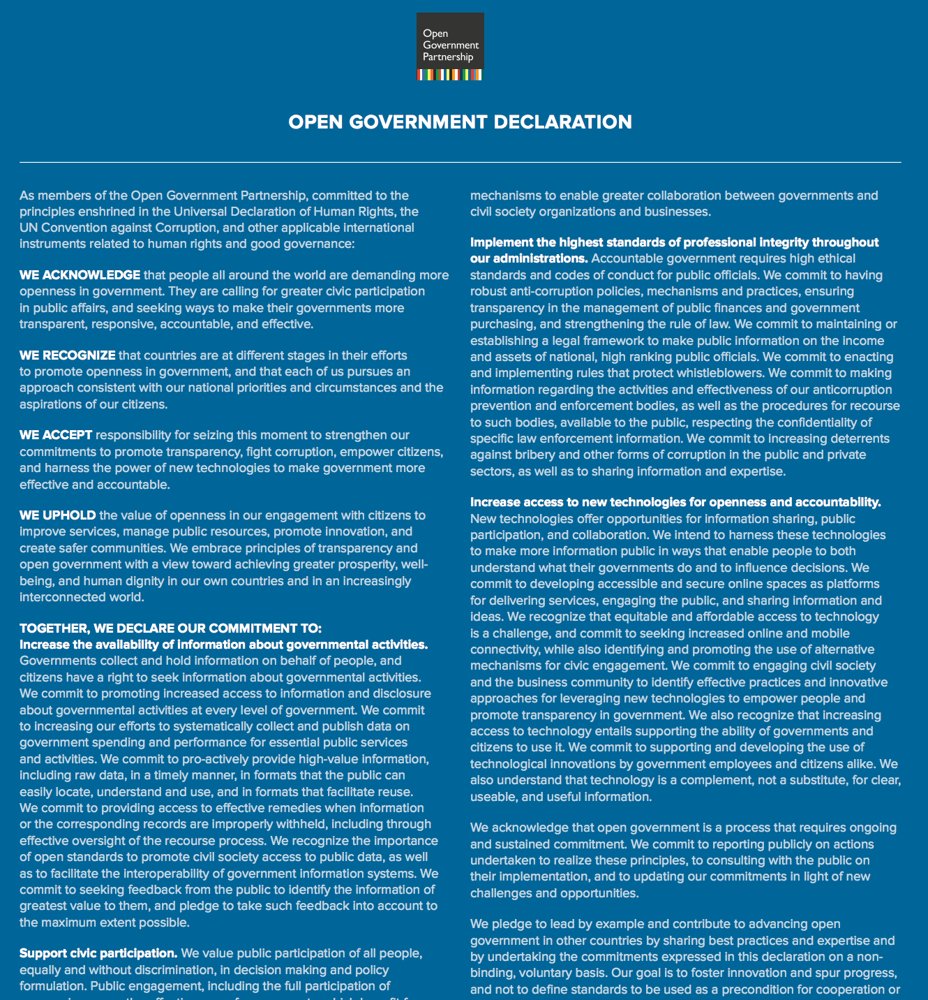
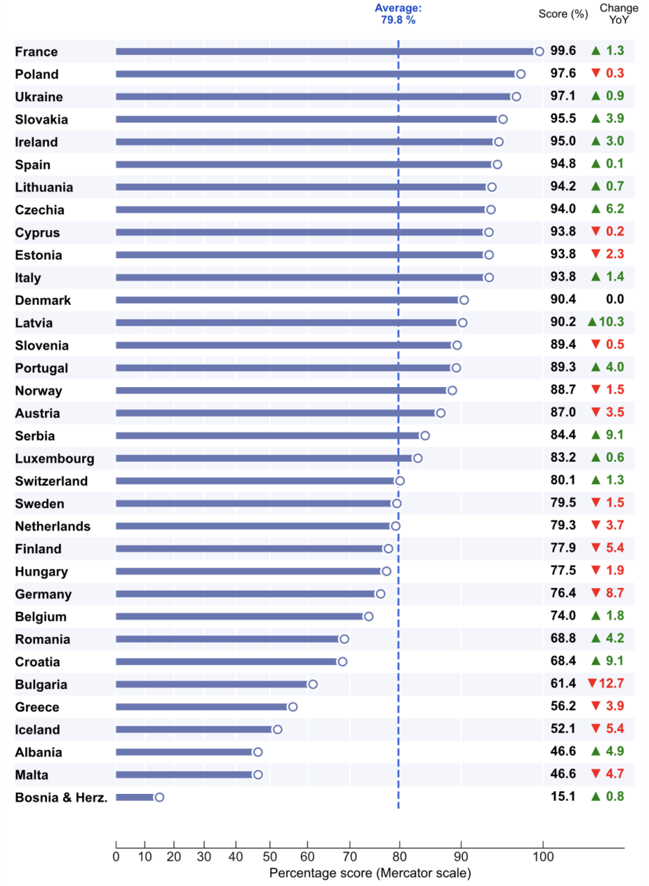
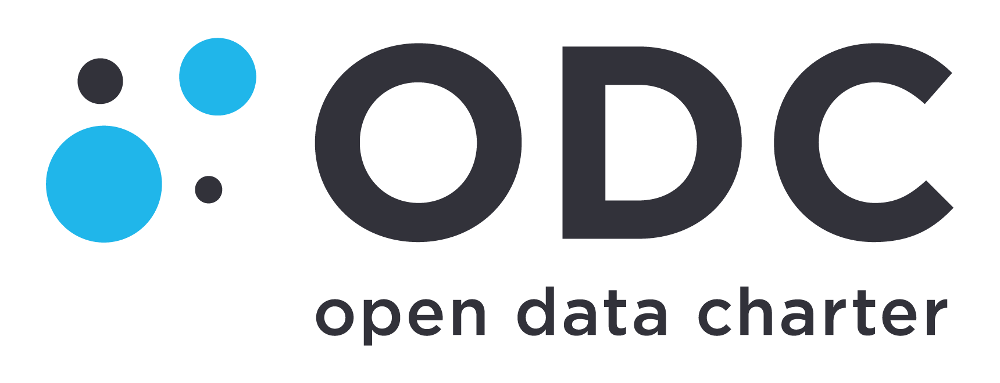
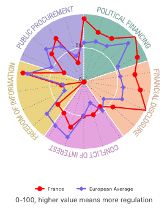
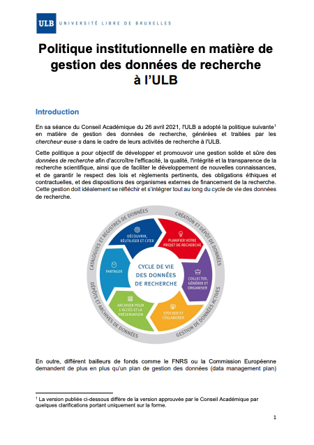
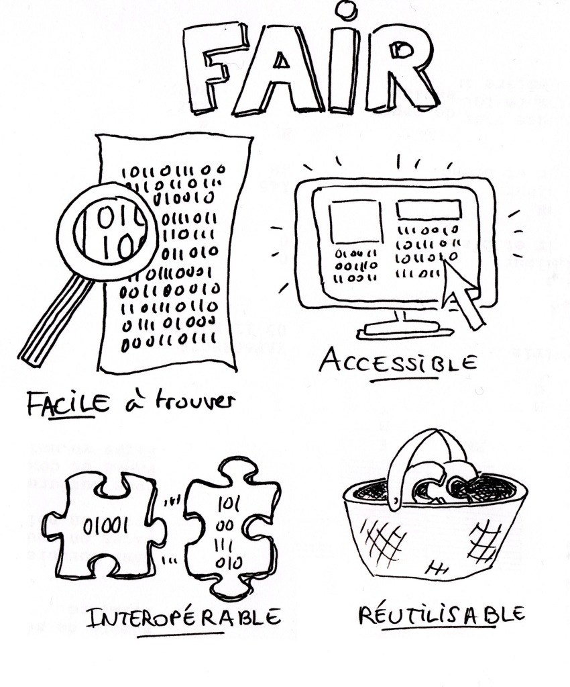
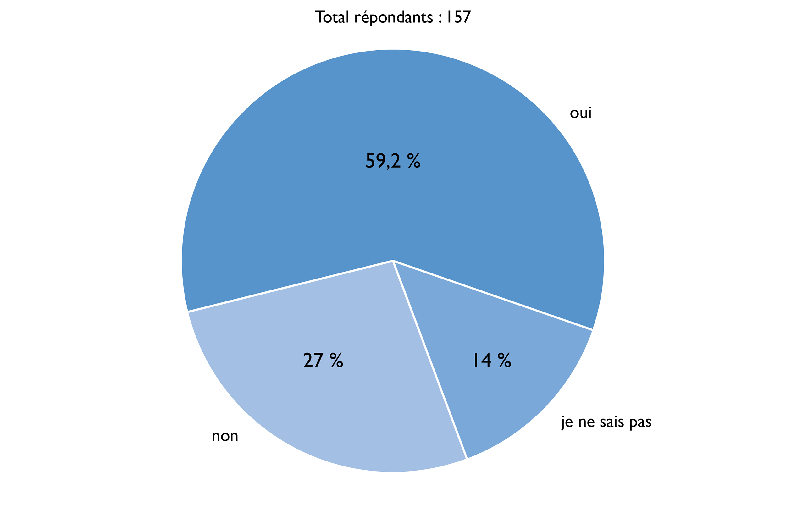

class: center, middle, inverse, title-slide

<!--
Le cours était plutôt court (1h45 en comptant 15 minutes de pause), on peut ajouter à la fin le début du cours 2 sur la gestion des données et les PGD, et remettre dans le cours 2 les diapos à partir de "La production des données est indissociable du travail du chercheur". 
Penser aussi à ajouter au début des diapos sur la notion de données (définition, pyramide...) empruntées à Datactivist.
-->

# Fondements de l'open data

## M1 Sciences de l'éducation Cours "Usages de l'open data en SHS"

### Antoine Blanchard

### Septembre 2025
 
 

.center[

]

.center[Cette présentation réutilise des [contenus publiés par Datactivist](https://datactivist.coop/oraccle/comprendre_open_data/comprendreod.html) sous licence CC-BY-SA.]

---
class: clear

### Avant de commencer : petit auto-portrait chinois

## Si j'étais une donnée, je serais...

.center[

]

.footnote[[Public Domain Review](https://publicdomainreview.org/collection/engravings-from-a-french-ice-skating-manual-1813)]

???

Je commence : je serais une donnée sur la consommation énergétique des bâtiments de l'université de Bordeaux.

---
class: clear

## Qu'est-ce qu'une donnée en recherche ?
 
 

> « les données de la recherche sont définies comme des enregistrements factuels (chiffres, textes, images et sons), qui sont utilisés comme sources principales pour la recherche scientifique et sont généralement reconnus par la communauté scientifique comme nécessaires pour valider les résultats de la recherche »

.footnote[[*Principes et lignes directrices pour l’accès aux données de la recherche financée sur fonds publics*](http://www.oecd.org/fr/science/inno/38500823.pdf) (2007)]

???

Les données ne sont pas définies selon leurs propriétés intrinsèques mais selon leur fonction au sein de processus de recherche particuliers. Il n’est pas possible de les définir dans l’absolu :  elles existent dans un contexte et prennent leur sens en fonction de ce contexte et des conditions de travail qui s’y déroulent.

---
class: clear

## Les multiples facettes de l'open data

.center[

]

.footnote[Denis, J., & Goëta, S. (2017). "[Les facettes de l’Open Data : émergence, fondements et travail en coulisses](https://doi.org/10.4000/books.cdf.5005)" Dans P.-M. Menger & S. Paye (dir.), *Big data et traçabilité numérique*. Collège de France]

---
class: inverse, mline, center, middle

# Origines de l'open data

---
class: clear

## Open data : un terme récent

Le terme est apparu pour la première fois dans les années 1970 dans les accords qu’a signés la NASA avec des pays partenaires en vue du partage de données satellitaires. 

C’est en 1995 qu’on en voit le premier usage public aux Etats-Unis dans un rapport de la National Academy of Science intitutlé "_On the Full and Open Exchange of Scientific Data_".

Dans le langage courant, cela fait près de 20 ans que l'ouverture des données est devenue un élément majeur des politiques publiques numériques. 

** Explorons maintenant quelques grandes dates de l'apparition de l'open data.**

---
class: clear
## 2007 : [la rencontre de Sebastopol ](https://opengovdata.org/)
 
 
 
.pull-left[
**Quoi ?** Une rencontre de l'Open Governement Group à Sebastopol (Californie), siège des éditions O'Reilly

**Pourquoi ?** : Influencer le futur président des Etats Unis pour faire avancer l'open data

**Comment ?** En adoptant une déclaration définissant les grands principes de l'Open Government Data 

]

.pull-right[

]

???

"En décembre 2007, trente penseurs et activistes de l’Internet se sont donné rendez-vous à Sebastopol, au nord de San-Francisco. Leur objectif : définir le concept de données publiques ouvertes et le faire adopter par les candidats à l’élection présidentielle américaine. Les participants à la rencontre de Sebastopol sont issus pour la plupart des mouvements du logiciel et de la culture libres. Ces mouvements se trouvent au cœur de nombreuses innovations dans le domaine de l’informatique et d’Internet ces quinze dernières années.

On compte parmi eux Tim O’Reilly : auteur et éditeur américain, il est souvent à l’avant-garde des mouvements de l’informatique et de l’Internet, de l’open source jusqu’à l’expression même de Web 2.0 qu’il a définie et popularisée. 
Lawrence Lessig, professeur de droit à l’université de Stanford (Californie) est l’initiateur des licences Creative Commons, fondées sur l’idée du copyleft et de libre diffusion des connaissances.
Tom Steinberg (initiateur du site FixMyStreet)
Adrian Holovaty (le fondateur du service d’informations localisées EveryBlock)
Aaron Swartz, inventeur du système de flux RSS et militant de la connaissance libre

La contribution de Tim O’Reilly sur l’open government fait apparaître en pleine lumière la filiation entre le monde du « libre » et les principes émergents de l’open data : il s’agit clairement, explique-t-il, d’appliquer aux affaires publiques les principes de l’open source et ses méthodes de travail.

En 2007, cela pouvait apparaître comme un rêve. Mais le résultat a dépassé leurs espérances. Un peu plus d’un an plus tard, le président Barack Obama prend ses fonctions à la Maison-Blanche et signe trois mémorandums présidentiels. Deux d’entre eux concernent l’open government, dont l’open data est l’un des piliers. Les mémos du président placent explicitement l’action publique sous le signe de la culture de l’open source, en se réclamant de ses principes : « transparence, participation et collaboration »."

---
class: clear

## 2008 : Tim Berners-Lee ["Raw data now"](https://www.ted.com/talks/tim_berners_lee_on_the_next_web?language=fr)
#### La demande de données brutes sous les projecteurs

.reduite[.center[

]]

???

???

Principal inventeur du WWW. 
L’ouverture est enfin une injonction adressée aux détenteurs de données, tant publics que privés. Sur la scène de la conférence TED de 2009, Sir Tim Berners-Lee, l’inventeur des liens hypertextes et par extension du Web, pousse un cri de ralliement (pour les partisans d’un Web des données) et un cri de guerre aux détenteurs de données : « We want raw data, now ! » (vidéo: Tim Berners-Lee, TED, 2009). il encourage l'ensemble du monde à libérer leurs données afin de les connecter entre elles

---
class: clear

## 2011 : [la déclaration pour un gouvernement ouvert](https://www.opengovpartnership.org/fr/process/joining-ogp/open-government-declaration/)

.reduite[.center[]]

---
class: clear

## Depuis 2010 : l'ère des classements

.center[
]

---
class: clear 

## 2015 : la charte internationale de l'open data et ses 6 principes

 
 
 

.center[
]
 
 
Adoptée par 28 pays et plus de 140 localités.

???

The six ODC principles were developed in 2015 by governments, civil society, and experts around the world to represent a globally-agreed set of aspirational norms for how to publish data.

---
class: inverse, mline, center, middle

# Les 6 principes de l'open data

---
class: clear

## Données publiques ouvertes par défaut
 
 
**Premier principe** : que l'ouverture devienne la norme. Les données
publiques devraient être ouvertes, sauf exception légale,
sans que le public ait à les demander.

---
class:  clear

## Données à jour et complètes
 
 
**Deuxième principe** : que les données soient publiées sous leur
forme complète, dans le plus fort niveau de détail possible.
Elles doivent être mises à disposition dès que possible et,
lorsque c'est pertinent, en temps réel.

---
class:  clear

## Données accessibles et utilisables
 
 
**Troisième principe** : que les données soient exploitables par les
machines afin de faciliter leur traitement. Les données
doivent être dans un format ouvert, qui n'est pas la propriété
d’une organisation et fait l’objet d’une gouvernance ouverte.
Enfin, les données doivent être faciles à trouver sur des
portails et mises à disposition avec une licence ouverte
autorisant largement les usages les plus larges.

---
class: clear

## Données comparables et interopérables
 
 
**Quatrième principe** : que les données soient facilement
comparables grâce aux formats structurés et normalisés favorisant l'interopérabilité et la réutilisation. Le croisement des données augmente leur valeur !

---
class: clear

## Pour une gouvernance et un engagement citoyen
 
 
**Cinquième principe** : que l'open data améliore la gouvernance des
institutions et favorise la participation citoyenne. 

???

La reddition des comptes avec des données complètes et détaillées
permet aux citoyens de refaire les calculs, de proposer
d'autres manières d'analyser un phénomène et parfois de
contester une décision publique.

---
class: clear

## Pour un développement inclusif et l'innovation
 
 
**Sixième principe** : que la société civile et le secteur privé trouvent du pouvoir d'agir dans les données ouvertes, face aux défis du dérèglement climatique, de la montée des inégalités…

---
class: inverse, mline, center, middle

# Cadre juridique de l'open data

---
class: clear

## 1978 : La loi CADA, vers le "droit de savoir"

* Le fondement : la **Déclaration des Droits de l'Homme et du Citoyen de 1789** dans son article 15, "la Société a le droit de demander compte à tout Agent public de son administration." 

* Le droit d'accès des citoyens à l'information publique émerge en **1978 avec la loi dite CADA** du nom de la Commission d'Accès aux Documents Administratifs. 

* La France était le **3e pays au monde** après la Suède en 1766 et les Etats-Unis en 1966 avec le Freedom of Information Act (FOIA) en 1966  à accorder un "droit de savoir" avec pour but d'améliorer les relations entre le public et l'administration.

.footnote[Il faudrait maintenant désigner la loi comme le Code des relations entre le public et l'administration (CRPA) qui, dans son [livre 3](https://www.legifrance.gouv.fr/affichCode.do;jsessionid=BDF8EC0BD562E214CCD9A5ADD435D690.tplgfr42s_1?idSectionTA=LEGISCTA000031367685&cidTexte=LEGITEXT000031366350&dateTexte=20190429), codifie le droit d'accès et de réutilisation mais il est encore moins connu que la loi CADA…]

???

Aux Etats-Unis, après le Freedom of Information Act de 1966 oblige les agences fédérales à transmettre les documents classifiés à tout citoyen qui en fait la demande. En France, la Commission d'accès aux documents administratifs, CADA, créée en 1976 fait de même. Mais il n'y a pas si longtemps, les citoyens qui s'adressaient à la CADA étaient soumis à de fastidieuses procédures administratives et l'attente d'une réponse était très longue... 

---
class: clear

## La loi CADA : un point noir dans la transparence de la vie publique

Même si la France est le 3e pays à avoir adopté un droit d'accès, la loi CADA n'est pas un outil fort de la transparence de la vie publique. Ses principaux défauts : l'absence de sanctions et une procédure longue qui décourage les demandeurs et favorise le contournement par les administrations. 

.center[]

???

La France est moins bien notée que la moyenne de l'Europe sur le critère "Freedom of Information".

---
class: clear

## Les conditions d'exercice du droit d'accès

Une définition très large des documents administratifs :
> Les documents administratifs peuvent revêtir de nombreuses formes (dossiers, rapports, études, comptes rendus, procès-verbaux, statistiques, directives, instructions, circulaires, codes sources, etc.) et adopter tout support (écrit, enregistrement sonore ou visuel, forme numérique ou informatique). 

Le droit d'accès s'appplique aux documents administratifs produits dans le cadre d'une .red[mission de service public], c'est-à-dire :
> Une mission d'intérêt général sous le contrôle de l'administration et qui est dotée à cette fin de prérogatives de puissance publique. 

Il ne s’exerce que si l’administration a effectivement en sa possession le document demandé, que si le document est formellement **achevé**, qu'il existe et qu'il n'est pas **préparatoire à une décision administrative** en cours. 

---
class: clear

## Les exclusions au droit d'accès

Le droit d'accès **ne doit pas porter atteinte aux secrets protégés** : 
- le fonctionnement de l'État : délibérations du Gouvernement, secret de la défense nationale, la conduite de la politique extérieure de la France, la sûreté de l'État…
- la protection de la vie privée
- le secret médical
- le secret des affaires (secret des procédés, des informations économiques et financières et
des stratégies commerciales ou industrielle)
- les mentions portant une appréciation ou un jugement de valeur sur une personne physique ou
faisant apparaître un comportement d'une personne pouvant lui porter préjudice…

Le document ne peut être publié qu'après avoir fait l'objet d'un traitement permettant
d'**occulter les mentions protégées**. L’administration n’est pas tenue de publier un document lorsque “les travaux d’occultation dénatureraient ou videraient de sens le document” ou si “le document est indivisible ou l’occultation est trop complexe”.

---
class: clear

## Le cas des données personnelles

La mise en ligne de données à caractère personnel sans anonymisation est permise dans .red[**trois cas**] :
1. une disposition législative le prévoit (exemple : [Transparence Santé](https://www.data.gouv.fr/fr/datasets/transparence-sante-1/))
2. les personnes intéressées ont donné leur accord (consentement au sens de l’article 4 du RGPD)
3. les documents sont nécessaires à l'information du public ou conservés par les services publics d'archives ([article D312-1-3 du CRPA](https://www.legifrance.gouv.fr/codes/article_lc/LEGIARTI000037798163/2018-12-13))

Hors de ces cas, il faut **anonymiser les données**. Il ne s'agit pas seulement d'occulter les informations directement identifiantes (nom, téléphone, adresse…) mais de [respecter trois critères cumulatifs](https://www.cnil.fr/fr/le-g29-publie-un-avis-sur-les-techniques-danonymisation) :
- individualisation : est-il toujours possible d’isoler un individu ?  
- corrélation : est-il possible de relier entre eux des ensembles de données distincts concernant un même individu ?
- inférence : peut-on déduire de l’information sur un individu ?

???

"La base de données publique Transparence - Santé rend accessible l'ensemble des informations déclarées par les entreprises sur les liens d'intérêts qu'elles entretiennent avec les acteurs du secteur de la santé.

article D312-3-1 du CRPA : les organigrammes, les annuaires des administrations et la liste des personnes inscrites à un tableau d'avancement ou sur une liste d'aptitude pour l'accès à un échelon, un grade ou un corps ou cadre d'emplois de la fonction publique ;
Les résultats obtenus par les candidats aux examens et concours administratifs ou conduisant à la délivrance des diplômes nationaux

Ex. d'inférence : si l’attaquant sait qu’un individu figure dans l’ensemble de données et est né en 1964, il peut apprendre que cet individu a fait une crise cardiaque

---
class: clear

## Loi pour une République Numérique : l'ouverture des données par défaut

Promulguée le 7 octobre 2016, le titre 1 de la [loi pour une République  Numérique](https://www.legifrance.gouv.fr/loda/id/JORFTEXT000033202746) porte sur l'ouverture des données publiques. 

La loi impose un principe d'.red[**ouverture des données par principe**] (mais sans sanction prévue) à toutes les administrations, les entreprises délégataires d'une mission de service public et les .red[**collectivités locales de plus de 3500 habitants et 50 agents**]. 

L'ouverture concerne un .red[**périmètre très large**] : 
* les documents communiqués suite à des demandes CADA
* les "bases de données"
* les données "dont la publication présente un intérêt économique, social, sanitaire ou environnemental".

Rares sont donc les données publiques qui ne sont pas concernées par cette obligation d'ouverture. 

---
class: clear

## La Loi république numérique concerne aussi la recherche (1)

En 2016, la Loi République numérique a introduit plusieurs dispositions importantes :

1. Par principe, **les données produites ou reçues dans le cadre de la recherche
publique sont juridiquement considérées comme des « documents
administratifs » ou des informations publiques**. Par conséquent, ce sont les
établissements de recherche qui, en tant qu’administrations publiques, sont les
garants, pour les collectifs de recherche, de la mise en œuvre de l’open data des
données publiques et non les chercheurs à titre individuel.

2. Les données de recherche issues de l’activité courante des établissements de
recherche et détenues par eux sont ainsi soumises, sauf exceptions, aux **principes
d'ouverture par défaut et de libre réutilisation** fixés par le Code des relations entre le public et l'administrations.

3. Leur réutilisation est libre, à condition de mentionner la source et la date de mise à jour, de ne pas les altérer et les dénaturer. L'utilisation d'une licence est optionnelle et ne sert qu’à indiquer plus précisément leurs droits aux utilisateurs.

---
class: clear

## La Loi république numérique concerne aussi la recherche (2)
 

<wbr>4. Dans le cas de projets partenariaux associant des financements publics et des financements privés, **les données issues d'une recherche financée à plus de 50% par des acteurs privés sont exclues du principe d'ouverture par défaut** et de libre réutilisation. Des modalités de partage peuvent alors figurer dans les clauses contractuelles convenues entre les partenaires de recherche. 

<wbr>5. **Les données protégées par un droit spécifique ou une réglementation particulière sont exclues du principe d'ouverture par défaut** et de libre réutilisation : secrets protégés par la loi, données protégées par les droits des tiers, informations à régime restrictif, données non achevées…

.footnote[Cécile Arènes, Lionel Maurel, Stephanie Rennes (2022). *Guide d'application de la Loi pour une République numérique pour les données de la recherche. Comité pour la science ouverte*. https://dx.doi.org/10.52949/31]

---
class: clear

## Principe "Aussi ouvert que possible, aussi fermé que nécessaire"
 

> "Les États membres devraient veiller à ce que **les données de la recherche financée par des fonds publics deviennent et demeurent faciles à trouver,
accessibles, interopérables et réutilisables (principes FAIR)** dans un environnement sécurisé et fiable, par l'intermédiaire d'infrastructures numériques (…), **sauf si cela se révèle impossible ou incompatible avec la poursuite de l'exploitation des résultats de recherche ("aussi ouvert que possible, mais aussi fermé que nécessaire")**. Il peut y avoir plusieurs raisons à cela, dont notamment le respect de la vie privée, les secrets industriels, la sûreté nationale, les intérêts commerciaux légitimes et les droits de propriété intellectuelle détenus par des tiers."

.footnote[[*Recommandation 2018/790](https://eur-lex.europa.eu/legal-content/FR/TXT/PDF/?uri=CELEX:32018H0790&from=EN) de la Commission européenne du 25 avril 2018 relative à l'accès aux informations scientifiques et à leur conservation*]

???

Ce n'est pas parce que le principe d'ouverture par défaut a des exceptions qu'il n'existe pas. Aucun principe n'est absolu.

---
class: clear 

## Politiques des données de recherche (1)

.pull-left[
- 2018 : Plan national pour la science ouverte du Ministère de l'enseignement supérieur, de la recherche et de l'innovation
> Mesure 4 : Rendre obligatoire la diffusion ouverte des données de recherche issues de programmes financés par appels à projets sur fonds publics.
]

[.pull-right[
]
](https://www.ouvrirlascience.fr/plan-national-pour-la-science-ouverte/)

---
class: clear

## Politiques des données de recherche (2)

.pull-left[
- 2021 : Deuxième Plan national pour la science ouverte

> Mesure 4 : Mettre en œuvre l’obligation de diffusion des données de recherche financées sur fonds publics.

> Mesure 5 : Créer Recherche Data Gouv, la plateforme nationale fédérée des données de la recherche.

> Mesure 6 : Promouvoir l’adoption d’une politique de données sur l’ensemble du cycle des données de la recherche, pour les rendre FAIR.]

[.pull-right[
]
](https://www.ouvrirlascience.fr/deuxieme-plan-national-pour-la-science-ouverte/)

???

45 minutes sont passées : pause

---
class: clear

## Politiques des données de recherche (3)
 

.pull-left[
- politiques d'établissement pour la gestion des données de la recherche 

Exemple de l'Université libre de Bruxelles (pp. 5-7) : https://s.42l.fr/ulb]

[.pull-right[
]
](https://www.ulb.be/medias/fichier/ulb-gdr-politique_1647421928681-pdf)

???

Les laisser lire le texte (pp. 5-7) et le debriefer à l'oral. Qu'en retenez-vous ? Qu'est-ce qui vous surprend ?

---
class: clear

## Les principes FAIR : 4 principes fondamentaux

.center[
]

.footnote[Emmanuelle Bermès (2024). "Recherche : bilan personnel 2023", *Figoblog*, 19 janvier, https://figoblog.org/2024/01/19/recherche-bilan-personnel-2023/]

???

Principes mentionnés dans la politique institutionnelle de l'ULB.

---
class: clear

## Les principes FAIR en pratique
 

.center[
<iframe frameborder="0" width="750px" height="420px" src="https://view.genial.ly/5d64fbbd8352350fa3d22603" type="text/html" allowscriptaccess="always" allowfullscreen="true" scrolling="yes" allownetworking="all"></iframe>]
 
.center[https://s.42l.fr/principes-FAIR]

---
class: clear

## Diversité des données de recherche en SHS

 
 

.center[
<iframe width="560" height="315" src="https://www.youtube.com/embed/J7nkClygNng" frameborder="0" allow="encrypted-media" allowfullscreen></iframe>]

???

Toute la vidéo.

La nature des données varie en fonction de la discipline, de l’objectif de la recherche, de la méthodologie et de l’instrumentation mobilisés.

---
class: clear

## La production des données est indissociable du travail du chercheur (1)
 

> Les scientifiques s’attirent davantage de crédit pour la collecte ou la création de nouvelles données que pour l’exploitation de données existantes.

.footnote[Borgman, Christine L. (2020). *Qu’est-ce que le travail scientifique des données ? Big data, little data, no data*. Marseille : OpenEdition Press. https://doi.org/10.4000/books.oep.14792]

---
class: clear

## La production des données est indissociable du travail du chercheur (2)
 

.center[
<iframe width="560" height="315" src="https://www.canal-u.tv/chaines/univ-bordeaux/embed/107705?t=852" allowfullscreen></iframe>
]

.footnote[Pablo Diaz (2021). "Session 3 - « Ouvert autant que possible ; fermé autant que nécessaire » : comment positionner le curseur ?", *Journées annuelles Mate-shs*, Bordeaux, 24-25 juin]

???

Jusqu'à "… même avec toute la bonne volonté du monde ça peut être problématique." (14'50)

Pablo Diaz est sociologue à l'université de Lausanne (FORS-Unil)

---
class: clear

## La production des données est indissociable du travail du chercheur (3)
 

> "il est souvent plus rapide de refaire une expérience plutôt que de fouiller pendant des jours à la recherche d’une donnée. La masse de données et d’expériences déjà existantes à travers la quantité de publications scientifiques à l’échelle mondiale est telle que le temps de recherche bibliographique dépasse souvent le temps que prendra l’expérience envisagée. C’est une des raisons majeures pour ne pas ré-utiliser des données existantes. On a plus vite fait de synthétiser et caractériser un produit soi-même plutôt que d’aller chercher dans une base de données toutes les synthèses alternatives possible et sa caractérisation."

.footnote[Extrait d'un plan de gestion des données en chimie de la matière molle]

---
class: clear

## Les données ont une valeur

> « Pour les données très sensibles comme celles-là (sensibles parce que c’est 1 500 € le séquençage), on a un triple stockage. »

&nbsp;

> « La valeur qu’on peut donner aux données, c’est toute la masse d’argent qui a été investie pour les obtenir. Par masse d’argent, je pense aux animaux, aux réactifs, aux salaires… »

&nbsp;

> « Il y a un aspect un peu précieux de la donnée, qui est qu’on ne la montre pas avant de l’avoir soi-même exploitée. C’est tout l’enjeu de la compétition scientifique. »

.footnote[Violaine Rebouillat (2021). "Le partage des données vu par les chercheurs : une approche par la valeur". *Les Enjeux de l'information et de la communication*, 22(1), 35-53. https://doi.org/10.3917/enic.030.0035]

---
class: clear

## S'ils quittaient leur labo, les chercheurs emporteraient-ils leurs données avec eux ?

.center[

]

.footnote[Philippe Amiel, Francesca Frontini, Pierre-Yves Lacour et Agnès Robin (2020). “Pratiques de gestion des données de la recherche : une nécessaire acculturation des chercheurs aux enjeux de la science ouverte ?”. *Cahiers Droit, Sciences & Technologies*, Vol. 10, pp. 147-168.]

---
class: clear

## À retenir 
 
 
.big[- open data 
- aussi ouvert que possible, aussi fermé que nécessaire
- principes FAIR]