class: center, middle, inverse, title-slide

# Réutilisation des données en SHS

## M1 Sciences de l'éducation Cours "Usages de l'open data en SHS"

### Antoine Blanchard

### Septembre 2026
 
 

<!-- 
ajouter une diapo sur les méta-annuaires utilisés dans le devoir
-->

.center[

]

???

Commencer avec des rappels du cours précédent.

---
class: clear

## La production des données est indissociable du travail du chercheur (1)
 

> Les scientifiques s’attirent davantage de crédit pour la collecte ou la création de nouvelles données que pour l’exploitation de données existantes.

.footnote[Borgman, Christine L. (2020). *Qu’est-ce que le travail scientifique des données ? Big data, little data, no data*. Marseille : OpenEdition Press. https://doi.org/10.4000/books.oep.14792]

---
class: clear

## La production des données est indissociable du travail du chercheur (2)
 

.center[
<iframe width="560" height="315" src="https://www.canal-u.tv/chaines/univ-bordeaux/embed/107705?t=852" allowfullscreen></iframe>
]

.footnote[Pablo Diaz (2021). "Session 3 - « Ouvert autant que possible ; fermé autant que nécessaire » : comment positionner le curseur ?", *Journées annuelles Mate-shs*, Bordeaux, 24-25 juin]

???

Jusqu'à "… même avec toute la bonne volonté du monde ça peut être problématique." (14'50)

Pablo Diaz est sociologue à l'université de Lausanne (FORS-Unil)

---
class: clear

## La production des données est indissociable du travail du chercheur (3)
 

> "il est souvent plus rapide de refaire une expérience plutôt que de fouiller pendant des jours à la recherche d’une donnée. La masse de données et d’expériences déjà existantes à travers la quantité de publications scientifiques à l’échelle mondiale est telle que le temps de recherche bibliographique dépasse souvent le temps que prendra l’expérience envisagée. C’est une des raisons majeures pour ne pas ré-utiliser des données existantes. On a plus vite fait de synthétiser et caractériser un produit soi-même plutôt que d’aller chercher dans une base de données toutes les synthèses alternatives possible et sa caractérisation."

.footnote[Extrait d'un plan de gestion des données en chimie de la matière molle]

---
class: clear

## Les données ont une valeur

> « Pour les données très sensibles comme celles-là (sensibles parce que c’est 1 500 € le séquençage), on a un triple stockage. »

&nbsp;

> « La valeur qu’on peut donner aux données, c’est toute la masse d’argent qui a été investie pour les obtenir. Par masse d’argent, je pense aux animaux, aux réactifs, aux salaires… »

&nbsp;

> « Il y a un aspect un peu précieux de la donnée, qui est qu’on ne la montre pas avant de l’avoir soi-même exploitée. C’est tout l’enjeu de la compétition scientifique. »

.footnote[Violaine Rebouillat (2021). "Le partage des données vu par les chercheurs : une approche par la valeur". *Les Enjeux de l'information et de la communication*, 22(1), 35-53. https://doi.org/10.3917/enic.030.0035]

---
class: clear

## S'ils quittaient leur labo, les chercheurs emporteraient-ils leurs données avec eux ?

.center[
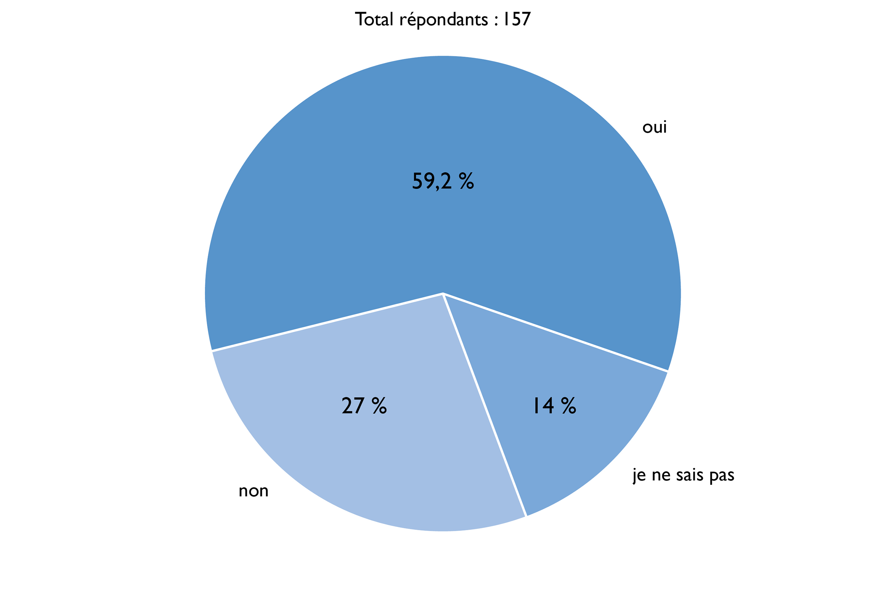
]

.footnote[Philippe Amiel, Francesca Frontini, Pierre-Yves Lacour et Agnès Robin (2020). “Pratiques de gestion des données de la recherche : une nécessaire acculturation des chercheurs aux enjeux de la science ouverte ?”. *Cahiers Droit, Sciences & Technologies*, Vol. 10, pp. 147-168.]

---
class: inverse, mline, center, middle

# La recherche partage ses données

---
class: clear

## Enfin, souvent elle ne les partage pas… (1)
 

.center[
<iframe width="700" height="500" src="https://webtv.univ-rouen.fr/permalink/v125d03a1043cxgjgzvd/iframe/#start=337" allowfullscreen="allowfullscreen" allow="autoplay"></iframe>]

???

Jusqu'à 6'21 : "Marie-Claude Taupin est décédée il y a tout juste un mois et nous avons récupéré à cette occasion-là ses précieux carnets de fouille qu'elle avait à vrai dire du mal à nous donner."

Chercheurs, n'attendez pas votre mort pour ouvrir vos données de recherche !

---
class: clear

## Enfin, souvent elle ne les partage pas… (2)
 

.center[
<iframe width="560" height="315" src="https://www.canal-u.tv/chaines/univ-bordeaux/embed/107697?t=4017" allowfullscreen></iframe>
]

.footnote[Lionel Maurel (2021). "Le partage des données de recherche en SHS à l’heure de la Science Ouverte", *Journées annuelles Mate-shs*, 24-25 juin]

???

Jusqu'à "… ont fini par se brouiller sur cette question de l'accès aux données" (1h07'53)

Lionel Maurel, Directeur adjoint scientifique à l’InShs en charge de la Science Ouverte et des données de recherche : « Les données revêtent des enjeux de pouvoir, nous avons régulièrement le retour d’unités de recherche où l’accès aux données dégénère en conflit ou fait voler en éclat un partenariat : le paradigme de l’ouverture par défaut des données régule cela. »

---
class: clear

## Et c'est un paradoxe !
 
 

> "L’un des intérêts de l’étude de C. Tenopir (menée auprès de 1329 chercheurs) est aussi d’avoir souligné un paradoxe : **les chercheurs conviennent à 60% que le manque d’accès aux données constitue un obstacle majeur au progrès de la science, mais déclarent pour 46% d’entre eux ne pas mettre leurs données à disposition**."

.footnote[Rebouillat, Violaine (2021). Le partage des données vu par les chercheurs : une approche par la valeur. *Les Enjeux de l'information et de la communication*, 22(1), 35-53. https://doi.org/10.3917/enic.030.0035]

---
class: clear

## Le chercheur, producteur, propriétaire, n'est pas partageur…
 
 

.center[
<iframe width="560" height="315" src="https://www.youtube.com/embed/xIgVGlb-6Uw?start=1281" frameborder="0" allow="encrypted-media" allowfullscreen></iframe>]

???

21'21 jusqu'à "… c'est très très difficile d'acculturer les chercheurs à cette question du partage et de l'open data." (21'52)

Acculturation nécessaire du chercheur qui se sent propriétaire des données.

---
class: clear

## Partager ses données de recherche

 
 

.center[
<iframe width="560" height="315" src="https://www.youtube.com/embed/ybLIuTv8_Sg?start=178" frameborder="0" allow="encrypted-media" allowfullscreen></iframe>]

???

Témoigne d'une chercheuse en topographie qui partage ses données de recherche (2'58 jusqu'à la fin de l'entretien avec Tania à 4'48).

---
class: clear

## Réutiliser les données pour la recherche
 

> « Ça n’est pas juste partager les données pour partager les données. Il y a toute une mentalité derrière, qui est concomitante. **La modélisation, que j’ai faite durant ma thèse sur les primates, a ensuite été réutilisée par d’autres personnes, qui ont utilisé mes formules chez les humains et qui m’ont posé des questions auxquelles j’ai répondu. Du coup, c’est intéressant**, parce que vous n’êtes pas forcément co-auteur de ces publications mais vous êtes cités. Et ensuite les personnes vous connaissent. Ça veut dire que, quand elles ont besoin d’organiser un symposium, elles vont faire appel à vous. **Donc vous n’êtes pas récompensés tout de suite, mais un peu plus tard.** »

.footnote[Rebouillat, Violaine (2021). Le partage des données vu par les chercheurs : une approche par la valeur. *Les Enjeux de l'information et de la communication*, 22(1), 35-53. https://doi.org/10.3917/enic.030.0035]

---
class: clear

## Réutiliser les données pour l'enseignement
 

.center[
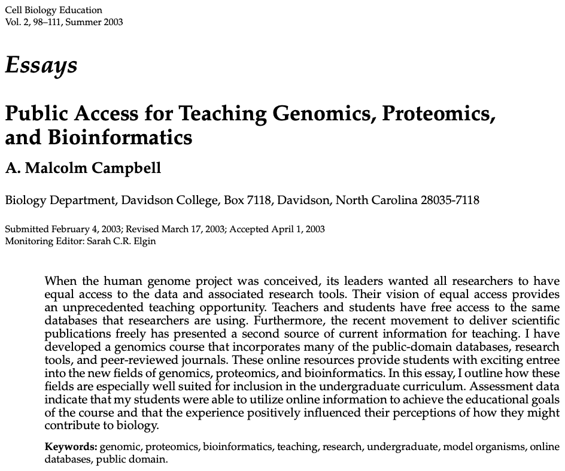]

---
class: clear

## Exemple de données ouvertes : la recherche sur Alzheimer

.center[
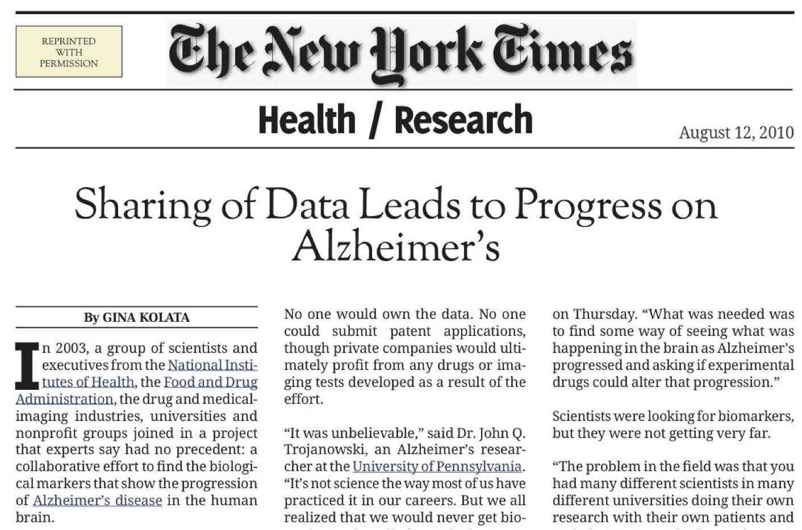]

---
class: clear

## Exemple de données ouvertes : le génome des plantes cultivées
 

.center[
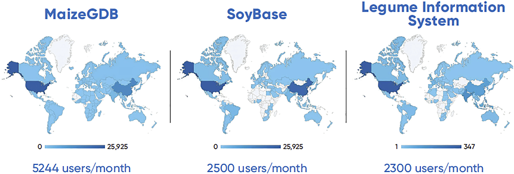]

.footnote[Jim Gaffney et al. (2020). "Open access to genetic sequence data maximizes value to scientists, farmers, and society". *Global Food Security*, Vol. 26, 100411. https://doi.org/10.1016/j.gfs.2020.100411.]

---
class: clear

## Exemple de données ouvertes : la [base SIRENE](https://www.data.gouv.fr/fr/datasets/base-sirene-des-entreprises-et-de-leurs-etablissements-siren-siret/)

.reduite.center[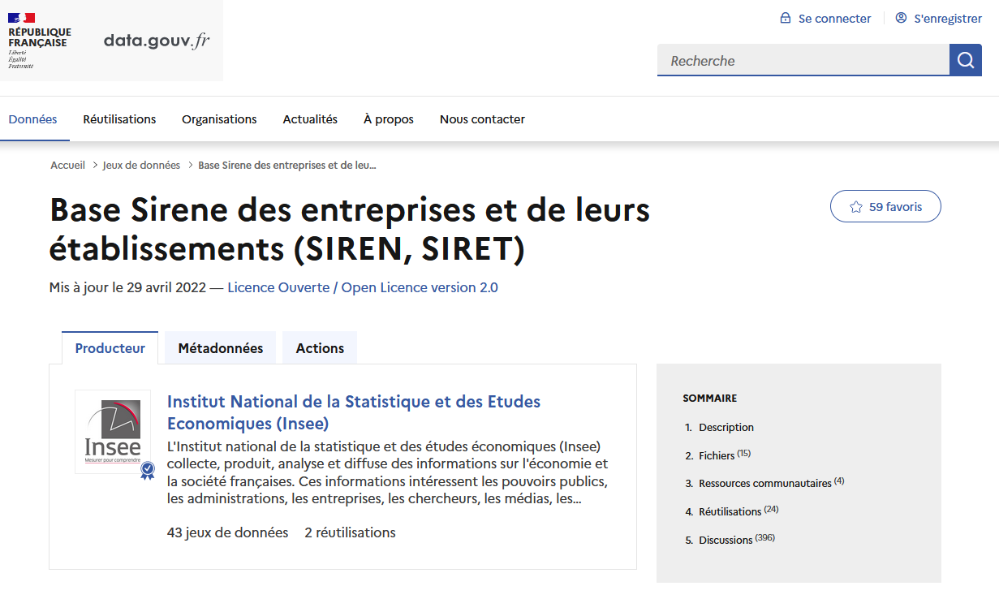]

---
class: clear

## Exemple de données ouvertes : les [valeurs foncières](https://www.data.gouv.fr/fr/datasets/demandes-de-valeurs-foncieres/)

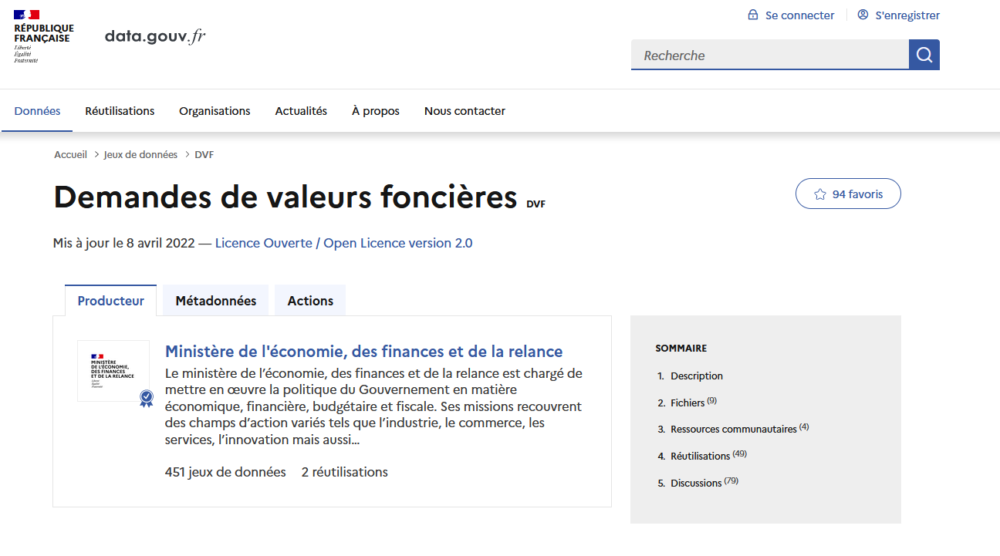

---
class: clear

## Exemple de réutilisation : les valeurs foncières

.reduite.center[
[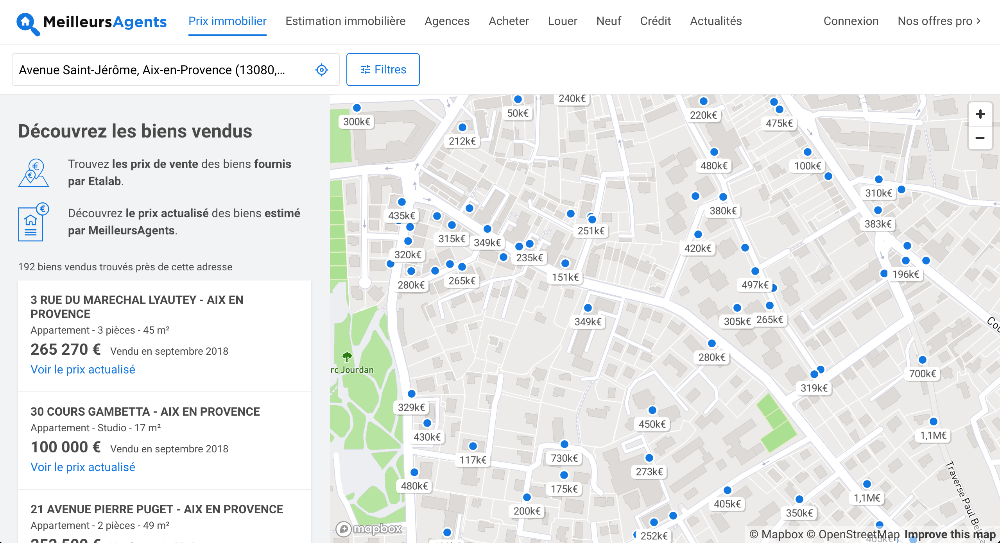](https://www.meilleursagents.com/prix-immobilier/dvf/aix-en-provence-13100/avenue-saint-jerome-1108044769/)
]

???

Outre Meilleurs Agents, ces données sont utilisées par SeLoger, des startups (Homedata, Kelquartier...) et des acteurs publics (MTE, CEREMA, ADEME).

---
class: clear

## Exemple de données ouvertes : [Campagnes photographiques des Monuments Historiques](https://data.culture.gouv.fr/explore/dataset/photographies-serie-monuments-historiques-de-1851-a-1914/images/?refine.nom_reg=BRETAGNE&refine.nom_dept=FINISTERE&dataChart=eyJxdWVyaWVzIjpbeyJjaGFydHMiOlt7InR5cGUiOiJjb2x1bW4iLCJmdW5jIjoiQ09VTlQiLCJzY2llbnRpZmljRGlzcGxheSI6dHJ1ZSwiY29sb3IiOiIjNjZjMmE1In1dLCJ4QXhpcyI6Im5vbV9yZWciLCJtYXhwb2ludHMiOjUwLCJzb3J0IjoiIiwiY29uZmlnIjp7ImRhdGFzZXQiOiJwaG90b2dyYXBoaWVzLXNlcmllLW1vbnVtZW50cy1oaXN0b3JpcXVlcy1kZS0xODUxLWEtMTkxNCIsIm9wdGlvbnMiOnt9fX1dLCJ0aW1lc2NhbGUiOiIiLCJkaXNwbGF5TGVnZW5kIjp0cnVlLCJhbGlnbk1vbnRoIjp0cnVlfQ%3D%3D&location=5,46.50652,2.39891)
 
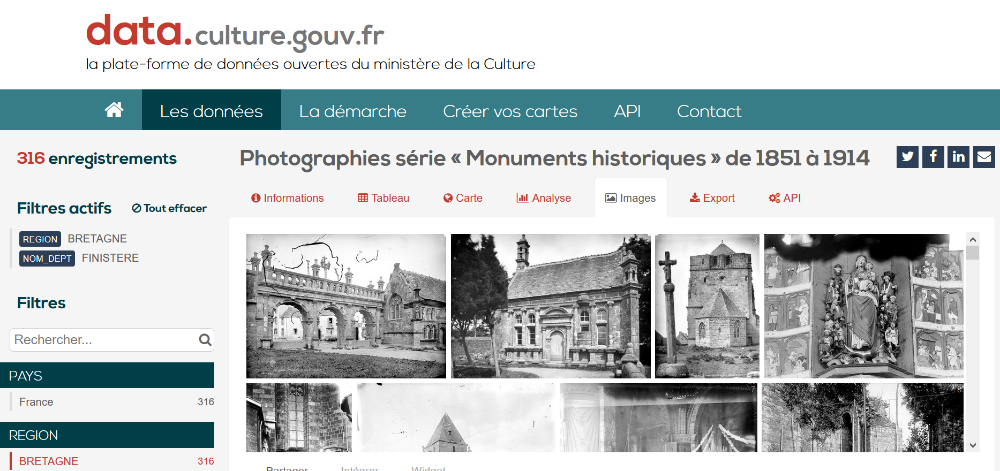

---
class: clear

## Exemple de données ouvertes : Open Food Facts 

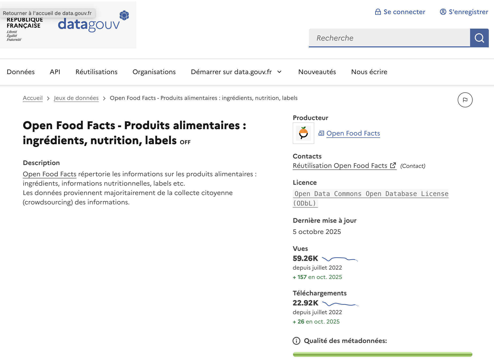
???

Fichier de 4 millions de lignes. Né en 2012 sous l'impulsion de deux français.

---
class: clear

## Exemple de réutilisation : Yuka

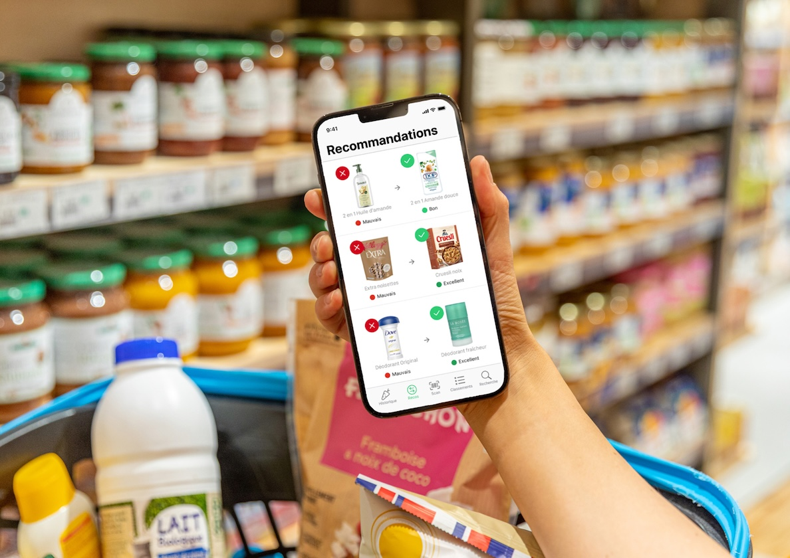

---
class: clear

## Exemple de réutilisation : l'étude NutriNet-Santé
 
L'Équipe de recherche en épidémiologie nutritionnelle (EREN) utilise Open Food Facts pour connaître la **composition des produits alimentaires consommés par les 160 000 participants de l'étude NutriNet-Santé**, vaste étude épidémiologique visant à analyser les liens entre la nutrition, la santé et les comportements alimentaires.
 
 
.center[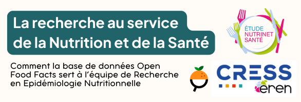]

.footnote[Source ": "[Blog Open Food Facts](https://blog.openfoodfacts.org/fr/news/la-recherche-au-service-de-la-nutrition-et-de-la-sante)"]

---
class: clear

## Exemple de données ouvertes : données temps réel sur les transports en commun

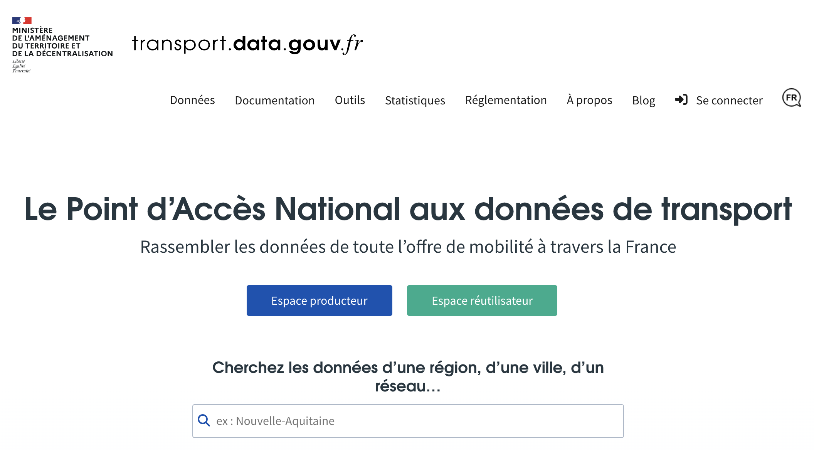
---
class: clear

## Exemple de réutilisation : les applications de mobilité

.center[
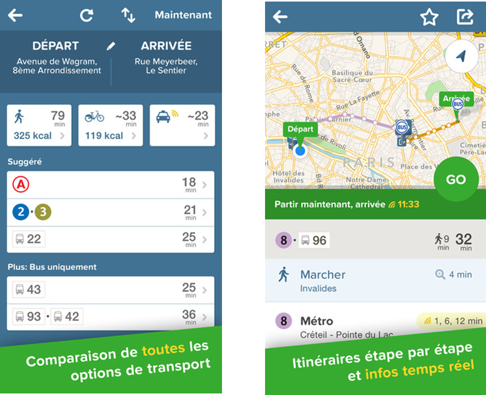
]

---
class: clear

## Exemple de données ouvertes : données sur le Covid-19

.pull-left[
_« Le libre accès aux données relatives à l’épidémie, ce qu’on appelle l’open data, assure la confiance des citoyens dans les éléments qui leur sont communiqués, favorise les actions de prévention contre la propagation du virus et facilite la prise de décision.
La diffusion et l’exploitation de ces données ont été rendues possibles grâce à une collaboration étroite entre plusieurs administrations et la société civile.»_

J. Salomon, directeur national de la santé, point presse coronavirus du 28 mars 2020

]

.pull-right[
[
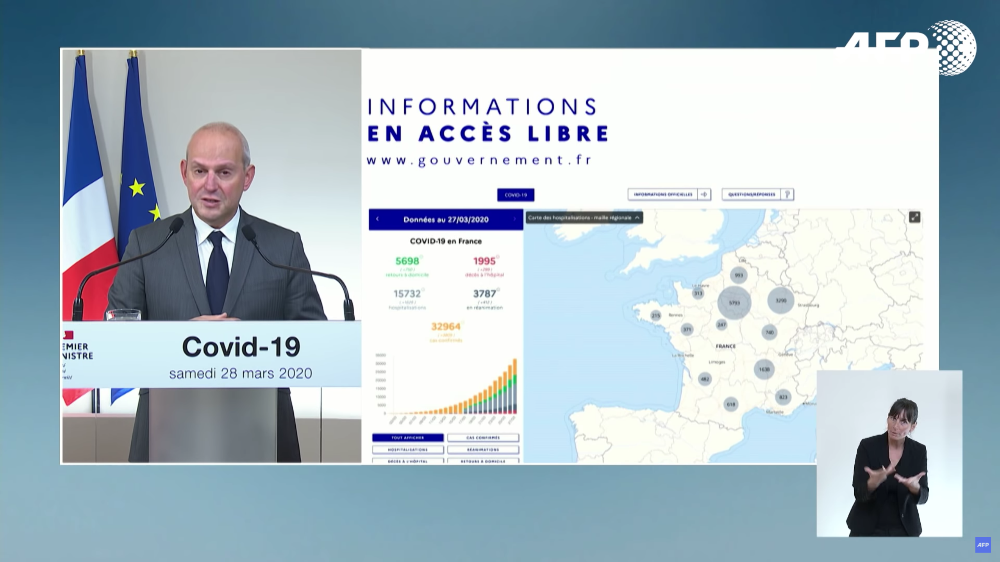](https://www.youtube.com/watch?v=dXvObKQ24ps)

]

---
class: clear 

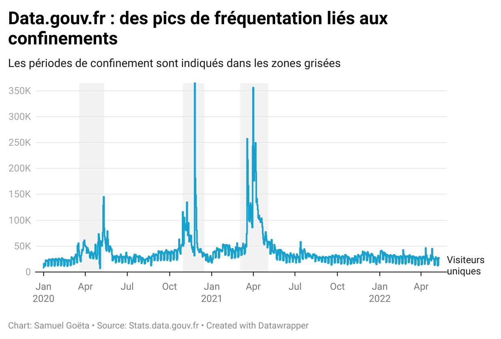

---
class: clear

## Exemple de réutilisation : les tableaux de bord Covid

.center[
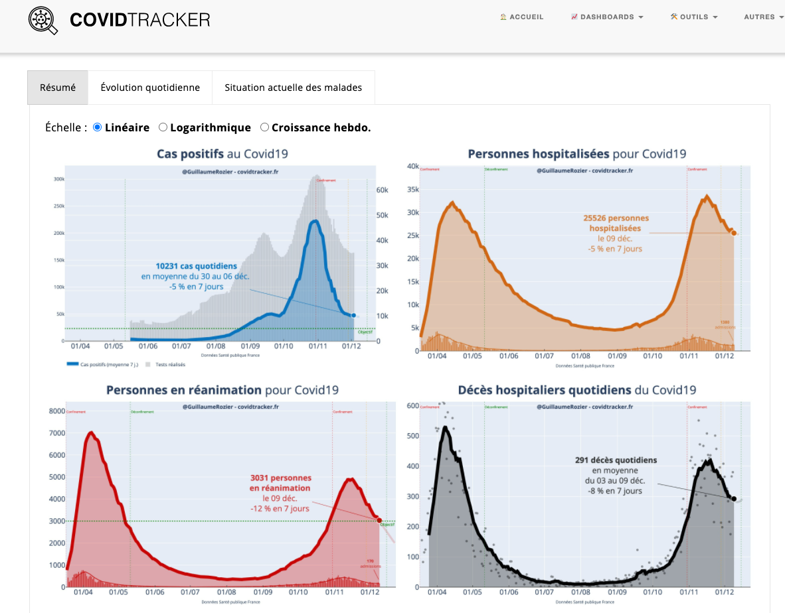
]

---
class: inverse, mline, center, middle

# La réalité des entrepôts de données

---
class: clear

## Le problème de la qualité des données
 
 
> **Les données des gouvernements sont souvent incomplètes, pas actualisées, de mauvaise qualité et fragmentaires.** 

> Dans la plupart des cas, les catalogues ou portails de données ouvertes sont alimentés manuellement, conséquence d’une approche informelle de la gestion des données. 

> De plus, les procédures, les calendriers et les responsabilités des institutions publiques chargées de leur gestion manquent souvent de clarté. Ainsi, de manière générale, la gestion et la publication des données ouvertes sont fragiles et sujettes à des erreurs multiples.

.footnote[Source : 
[Rapport mondial du 4e Open Data Barometer](https://opendatabarometer.org/4thedition/report/?lang=fr)
]

---
class: clear

## Des données bien cachées
 
 
> La découvrabilité des données est un défi majeur. Nous avons des portails et des registres de données, mais les organismes gouvernementaux qui relèvent d'un seul gouvernement national publient toujours les données de différentes façons et à différents endroits (...).

> **La découvrabilité des données est une condition préalable pour que les données ouvertes réalisent leur potentiel et, actuellement, la plupart des données sont très difficiles à trouver**.

.footnote[Source : https://index.okfn.org/insights/]

---
class: clear

## Différents types d'entrepôts de données de recherche

 
 

.center[
<iframe width="560" height="315" src="https://www.canal-u.tv/chaines/callisto/embed/134293?t=0" allowfullscreen></iframe>]

???

Toute la vidéo.

---
class: clear

## Une multitude de portails territoriaux

---
class: clear

## Une multitude de portails nationaux

???

1h de cours : faire une pause de 15 min puis lancer le devoir : les étudiants doivent créer un groupe et les deux étudiants rejoignent le groupe (je peux aussi le faire à la main). Ils déposent un seul devoir pour les deux.

---
class: inverse, mline, center, middle

# Devoir sur ordinateur

---
class: clear

## Évaluer un jeu de données à réutiliser
 

Ce devoir (à réaliser en binôme) vous met dans la peau d'un réutilisateur de données qui doit trouver des données publiées répondant à son besoin.
 
 
Vous allez suivre différentes étapes qui vont vous conduire à trouver et évaluer ce jeu de données.
 
 
.font180[➡️ https://moodle.u-bordeaux.fr/enrol/index.php?id=23745] 

???

Lien direct vers le devoir : https://moodle.u-bordeaux.fr/course/section.php?id=229581

Ouvert jusqu'au 4 octobre minuit.

Trois membres maximum par groupe.

---
class: inverse, mline, center, middle

# Conclusion : cycle de vie des données de recherche

---
class: clear

.center[
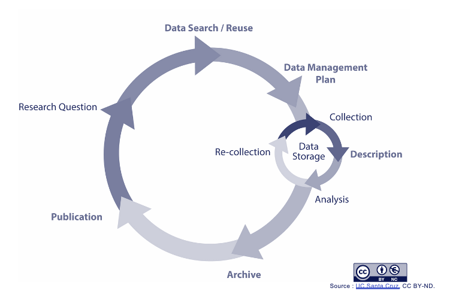]

ou bien https://www.ulb.be/medias/fichier/ulb-gdr-politique_1647421928681-pdf 

---
class: inverse, mline, center, middle

# Bonus

---
class: clear

.center[

]

