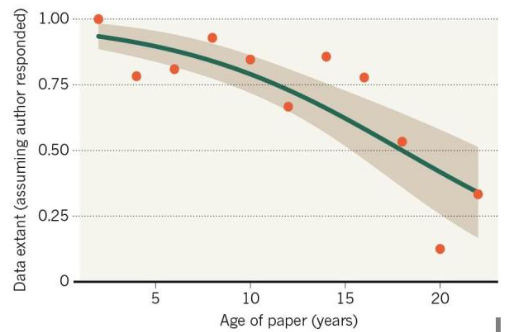
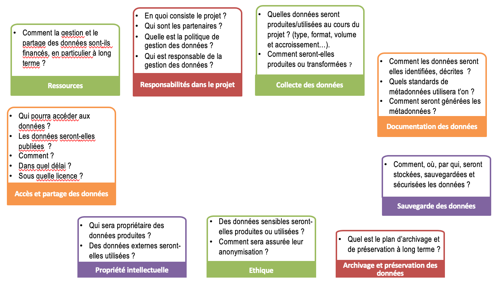
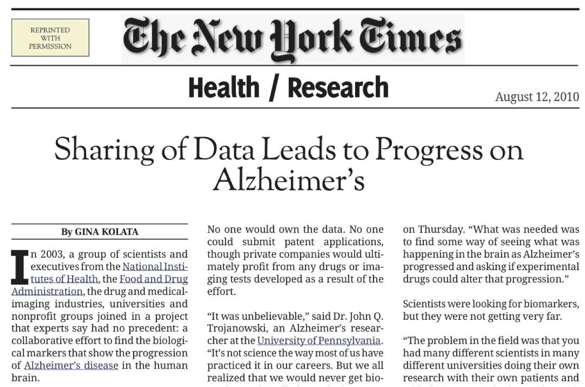
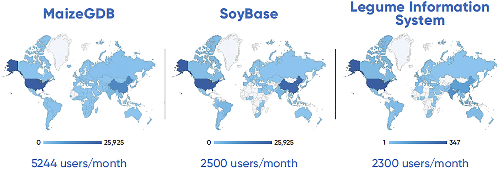

class: center, middle, inverse, title-slide

# Réutilisation des données en SHS

## M1 Sciences de l'éducation UE "Usages de l'open data en SHS"

### Antoine Blanchard

### Octobre 2025
 
 

.center[

]

---
class: inverse, mline, center, middle

# La recherche gère des données

---
class: clear

## La gestion des données : longtemps impensée
 
 

.center[
<iframe width="560" height="315" src="https://www.youtube.com/embed/o8acXD4s5iU?start=1863" frameborder="0" allow="encrypted-media" allowfullscreen></iframe>]

???

Jusqu'à "… pourquoi est-ce que finalement quand il s'agit de les verser dans le domaine public ou d'en faire une chose publique, pourquoi est-ce que cette chose n'est pas pensée ?" (33'44)

La stratégie de gestion des données reste le plus souvent impensée.

---
class: clear

## Si ce n'est pas le travail du chercheur, ça doit être celui de son institution !
 

> **Il faut envisager la gestion des données comme une affaire institutionnelle plutôt que comme la seule responsabilité du chercheur ou de la chercheuse**. Le niveau d’assistance fourni varie largement selon les domaines et les institutions. (…) Les universités et les autres institutions de recherche sont parfois bien dotées en professionnelles et professionnels de l’information pour aider à la gestion des données, à l’assignation de métadonnées, à la migration vers de nouvelles plateformes, au dépôt, à la découverte et aux types de coordination, mais elles restent une exception. (…) Pour les personnels de recherche, les bibliothèques, les départements et les chercheurs des universités, les données peuvent représenter une charge autant qu’un atout.

.footnote[Borgman, Christine L. (2020). *Qu’est-ce que le travail scientifique des données ? Big data, little data, no data*. Marseille : OpenEdition Press. https://doi.org/10.4000/books.oep.14792]

---
class: clear

## L'alternative : ne rien faire (au risque de perdre des données)

.center[
]

.footnote[Vines et al. (2014). "The Availability of Research Data Declines Rapidly with Article Age". *Current Biology* 24 , 94– 97, https://doi.org/10.1016/j.cub.2013.11.014]

???

*extant* = soit "partagées" soit "existantes mais pas partagées"

---
class: clear

## Planifier la gestion de ses données : le PGD (1)

.center[
<iframe src="https://view.genial.ly/6167ef6360a1bd0deae6ca66" width="100%" height="580"></iframe>]

???

Source : http://doi.org/10.13143/T3J4-VN03

---
class: clear

## Planifier la gestion de ses données : le PGD (2)
 

.center[
]

.footnote[Cocaud, Sylvie, et Dominique l’Hostis (2019). *Pourquoi et comment rédiger un plan de gestion de données ?*. https://hal.inrae.fr/hal-02791507]

---
class: inverse, mline, center, middle

# La recherche partage ses données

---
class: clear

## Enfin, souvent elle ne les partage pas… (1)
 

.center[
<iframe width="700" height="500" src="https://webtv.univ-rouen.fr/permalink/v125d03a1043cxgjgzvd/iframe/#start=337" allowfullscreen="allowfullscreen" allow="autoplay"></iframe>]

???

Jusqu'à 6'21 : "Marie-Claude Taupin est décédée il y a tout juste un mois et nous avons récupéré à cette occasion-là ses précieux carnets de fouille qu'elle avait à vrai dire du mal à nous donner."

Chercheurs, n'attendez pas votre mort pour ouvrir vos données de recherche !

---
class: clear

## Enfin, souvent elle ne les partage pas… (2)
 

.center[
<iframe width="560" height="315" src="https://www.canal-u.tv/chaines/univ-bordeaux/embed/107697?t=4017" allowfullscreen></iframe>
]

.footnote[Lionel Maurel (2021). "Le partage des données de recherche en SHS à l’heure de la Science Ouverte", *Journées annuelles Mate-shs*, 24-25 juin]

???

Jusqu'à "… ont fini par se brouiller sur cette question de l'accès aux données" (1h07'53)

Lionel Maurel, Directeur adjoint scientifique à l’InShs en charge de la Science Ouverte et des données de recherche : « Les données revêtent des enjeux de pouvoir, nous avons régulièrement le retour d’unités de recherche où l’accès aux données dégénère en conflit ou fait voler en éclat un partenariat : le paradigme de l’ouverture par défaut des données régule cela. »

---
class: clear

## Et c'est un paradoxe !
 
 

> "L’un des intérêts de l’étude de C. Tenopir (menée auprès de 1329 chercheurs) est aussi d’avoir souligné un paradoxe : **les chercheurs conviennent à 60% que le manque d’accès aux données constitue un obstacle majeur au progrès de la science, mais déclarent pour 46% d’entre eux ne pas mettre leurs données à disposition**."

.footnote[Rebouillat, Violaine (2021). Le partage des données vu par les chercheurs : une approche par la valeur. *Les Enjeux de l'information et de la communication*, 22(1), 35-53. https://doi.org/10.3917/enic.030.0035]

---
class: clear

## Le chercheur, producteur, propriétaire, n'est pas partageur…
 
 

.center[
<iframe width="560" height="315" src="https://www.youtube.com/embed/xIgVGlb-6Uw?start=1281" frameborder="0" allow="encrypted-media" allowfullscreen></iframe>]

???

Jusqu'à "… c'est très très difficile d'acculturer les chercheurs à cette question du partage et de l'open data." (21'52)

Acculturation nécessaire du chercheur qui se sent propriétaire des données.

---
class: clear

## Différents types d'entrepôts de données

 
 

.center[
<iframe width="560" height="315" src="https://www.youtube.com/embed/P612sq45XxE" frameborder="0" allow="encrypted-media" allowfullscreen></iframe>]

???

Toute la vidéo.

---
class: clear

## Partager ses données de recherche

 
 

.center[
<iframe width="560" height="315" src="https://www.youtube.com/embed/ybLIuTv8_Sg?start=178" frameborder="0" allow="encrypted-media" allowfullscreen></iframe>]

???

Témoigne d'une chercheuse en topographie qui partage ses données de recherche (jusqu'à la fin de l'entretien avec Tania à 4'48).

---
class: clear

## La situation particulière des SHS
 

.center[
<iframe width="560" height="315" src="https://www.canal-u.tv/chaines/univ-bordeaux/embed/107697?t=3483" allowfullscreen></iframe>]

???

Jusqu'à 1h06'27'' : "…l'argument n'était pas un argument discrétionnaire, ça devait être un argument fondé, et notamment un argument fondé en droit."

---
class: clear

## Qui va réutiliser les données de recherche ?
 

> « Ça n’est pas juste partager les données pour partager les données. Il y a toute une mentalité derrière, qui est concomitante. **La modélisation, que j’ai faite durant ma thèse sur les primates, a ensuite été réutilisée par d’autres personnes, qui ont utilisé mes formules chez les humains et qui m’ont posé des questions auxquelles j’ai répondu. Du coup, c’est intéressant**, parce que vous n’êtes pas forcément co-auteur de ces publications mais vous êtes cités. Et ensuite les personnes vous connaissent. Ça veut dire que, quand elles ont besoin d’organiser un symposium, elles vont faire appel à vous. **Donc vous n’êtes pas récompensés tout de suite, mais un peu plus tard.** »

.footnote[Rebouillat, Violaine (2021). Le partage des données vu par les chercheurs : une approche par la valeur. *Les Enjeux de l'information et de la communication*, 22(1), 35-53. https://doi.org/10.3917/enic.030.0035]

---
class: clear

## Réutilisations de données
### Pour l'enseignement
 

.center[
]

---
class: clear

## Réutilisations de données
### Pour la circulation des connaissances
 

> Par exemple, sollicité au sujet du projet **Wikidata**, le CNRS a répondu que les chercheurs avaient des droits d’auteurs sur leur contribution, or une telle réponse impliquerait de contacter un par un les 8 800 chercheurs du CNRS afin de pouvoir réutiliser leurs contributions. Lorsque ces mêmes chercheurs publient leurs données sous licence libre, dans *PLoS* par exemple, on est obligé de passer par un intermédiaire privé (une fondation) pour récupérer des données financées sur des fonds public…

.footnote[Collectif (2012). « Open data en SHS », in *THATCamp Paris 2012*. Paris : Éditions de la Maison des Sciences de l'Homme. http://editionsmsh.revues.org/364]

???

Qu'est-ce qui vous choque dans cet exemple ?

---
class: clear

## Des réutilisations de données à succès

.center[
]

---
class: clear

## Des réutilisations de données à succès
 

.center[
]

.footnote[Jim Gaffney et al. (2020). "Open access to genetic sequence data maximizes value to scientists, farmers, and society". *Global Food Security*, Vol. 26, 100411. https://doi.org/10.1016/j.gfs.2020.100411.]

---
class: clear

## Des réutilisations de données à succès
 

#### 1. Se rendre sur https://entrepot.recherche.data.gouv.fr/

--

#### 2. Trouver le jeu de données qui a été le plus téléchargé

--

#### 3. Formulez une hypothèse pour expliquer pourquoi ce jeu de données a été beaucoup téléchargé.

???

Ex. Dutch Data Prize 2022 : https://data.4tu.nl/articles/dataset/STORM_IBTrACS_present_climate_synthetic_tropical_cyclone_tracks/12706085/2

---
class: inverse, mline, center, middle

# Conclusion : cycle de vie des données de recherche

---
class: clear

.center[
]

ou bien https://www.ulb.be/medias/fichier/ulb-gdr-politique_1647421928681-pdf 

---
class: inverse, mline, center, middle

# Bonus

---
class: clear

.center[

]

---
class: clear

.center[

]

