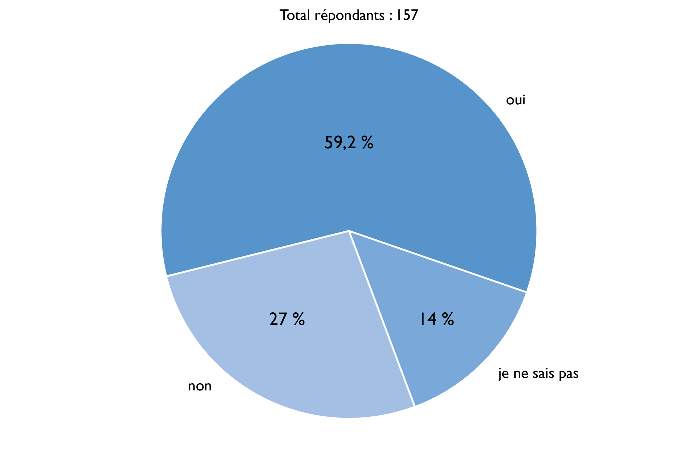
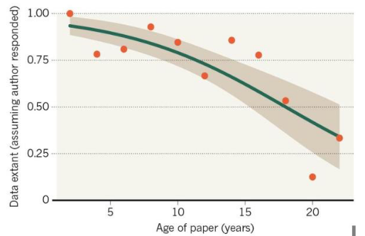
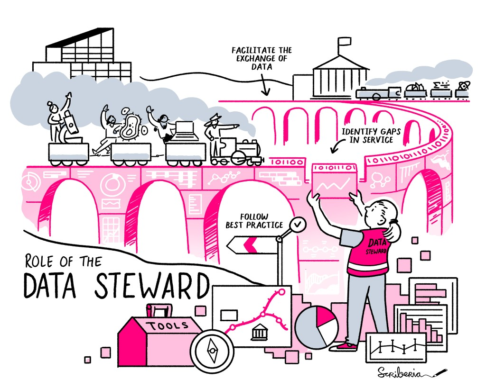
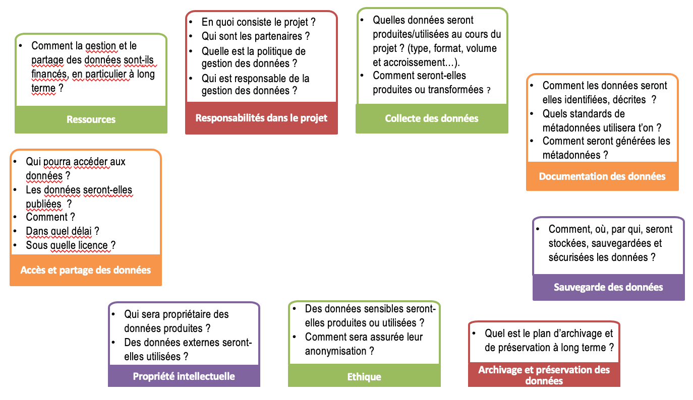
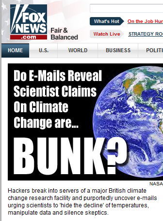
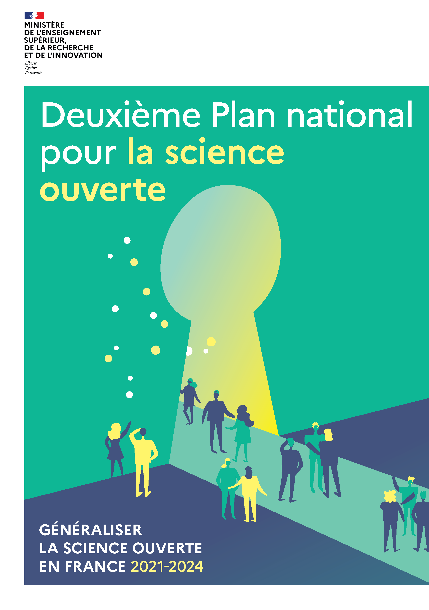
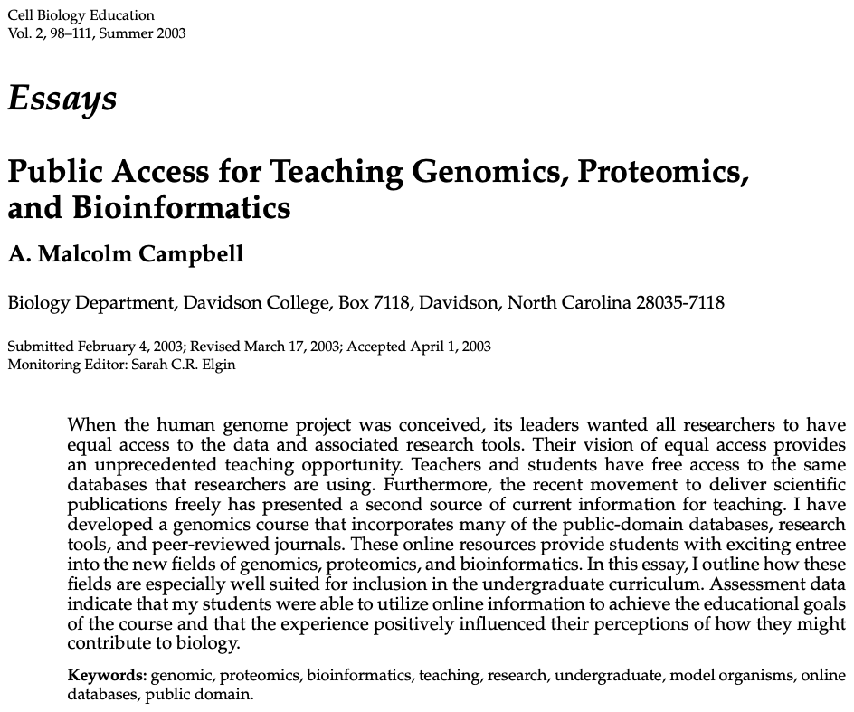
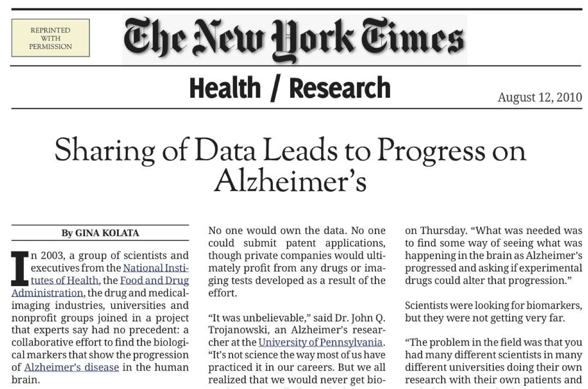
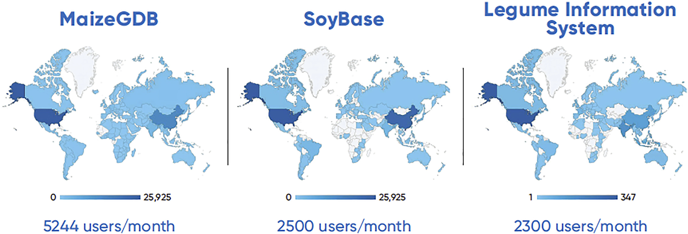
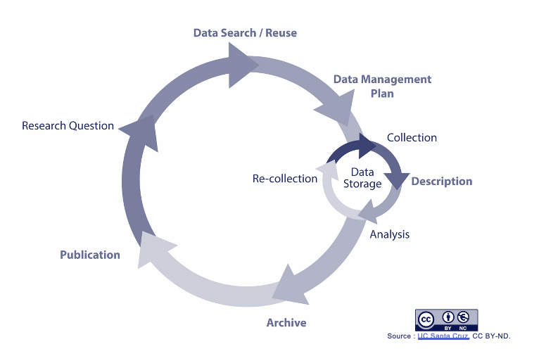

class: center, middle, inverse, title-slide

# Introduction aux données de la recherche

## BUT3A Infonum – UE "Sciences humaines et sociales"

### Antoine Blanchard

### Février 2024
 
 

.center[

]

---
class: inverse, mline, center, middle

# La recherche produit des données

---
class: clear

## Qu'est-ce qu'une donnée de recherche en SHS ?

 
 

.center[
<iframe width="560" height="315" src="https://www.youtube.com/embed/xgtrE5D2ixY?start=1602" frameborder="0" allow="encrypted-media" allowfullscreen></iframe>]

???

Jusqu'à "…convaincue qu'elle gérait des données de la recherche"

---
class: clear

## Qu'est-ce qu'une donnée de recherche ?

 
 

.center[
<iframe width="560" height="315" src="https://www.youtube.com/embed/J7nkClygNng" frameborder="0" allow="encrypted-media" allowfullscreen></iframe>]

???

Toute la vidéo.

La nature des données varie en fonction de la discipline, de l’objectif de la recherche, de la méthodologie et de l’instrumentation mobilisés.

---
class: clear

## Définition de l'OCDE
 
 

> « les données de la recherche sont définies comme des enregistrements factuels (chiffres, textes, images et sons), qui sont utilisés comme sources principales pour la recherche scientifique et sont généralement reconnus par la communauté scientifique comme nécessaires pour valider les résultats de la recherche »

.footnote[[*Principes et lignes directrices pour l’accès aux données de la recherche financée sur fonds publics*](http://www.oecd.org/fr/science/inno/38500823.pdf) (2007)]

???

Les données ne sont pas définies selon leurs propriétés intrinsèques mais selon leur fonction au sein de processus de recherche particuliers. Il n’est pas possible de les définir dans l’absolu :  elles existent dans un contexte et prennent leur sens en fonction de ce contexte et des conditions de travail qui s’y déroulent.

---
class: clear

## Le regard des chercheurs sur leurs données (1)
 
 

.center[
<iframe width="560" height="315" src="https://www.youtube.com/embed/xgtrE5D2ixY?start=1288" frameborder="0" allow="encrypted-media" allowfullscreen></iframe>]

???

Jusqu'à 24'44.

Sentiment de paternité des données. Temps investi par les chercheurs.

---
class: clear

## Le regard des chercheurs sur leurs données (2)
 
 

.center[
<iframe width="560" height="315" src="https://www.youtube.com/embed/xIgVGlb-6Uw?start=1281" frameborder="0" allow="encrypted-media" allowfullscreen></iframe>]

???

Jusqu'à 21'50.

Acculturation nécessaire du chercheur qui se sent propriétaire des données.

---
class: clear

## Le rapport des chercheurs avec leurs données (1)
 
 

.center[
<iframe width="560" height="315" src="https://www.youtube.com/embed/o8acXD4s5iU?start=2226" frameborder="0" allow="encrypted-media" allowfullscreen></iframe>]

???

Jusqu'à "… il se trouve être en contradiction avec les réalités juridiques et institutionnelles."

---
class: clear

## Le rapport des chercheurs avec leurs données (2)
 
 

.center[
<iframe width="560" height="315" src="https://www.youtube.com/embed/o8acXD4s5iU?start=2664" frameborder="0" allow="encrypted-media" allowfullscreen></iframe>]

???

Le sentiment de propriété augmente avec l'effort et l'investissement.

Jusqu'à "… un indice d'accroissement de ce sentiment de propriété."

---
class: clear

## La production des données est indissociable du travail du chercheur (1)
 

> "il est souvent plus rapide de refaire une expérience plutôt que de fouiller pendant des jours à la recherche d’une donnée. La masse de données et d’expériences déjà existantes à travers la quantité de publications scientifiques à l’échelle mondiale est telle que le temps de recherche bibliographique dépasse souvent le temps que prendra l’expérience envisagée. C’est une des raisons majeures pour ne pas ré-utiliser des données existantes. On a plus vite fait de synthétiser et caractériser un produit soi-même plutôt que d’aller chercher dans une base de données toutes les synthèses alternatives possible et sa caractérisation."

.footnote[Extrait d'un plan de gestion des données en chimie de la matière molle]

---
class: clear

## La production des données est indissociable du travail du chercheur (2)
 

.center[
<iframe width="560" height="315" src="https://www.canal-u.tv/chaines/univ-bordeaux/embed/107705?t=852" allowfullscreen></iframe>
]

.footnote[Pablo Diaz (2021). "Session 3 - « Ouvert autant que possible ; fermé autant que nécessaire » : comment positionner le curseur ?", *Journées annuelles Mate-shs*, Bordeaux, 24-25 juin]

???

Jusqu'à "… même avec toute la bonne volonté du monde ça peut être problématique."

---
class: clear

## La production des données est indissociable du travail du chercheur (3)
 

> Les scientifiques s’attirent davantage de crédit pour la collecte ou la création de nouvelles données que pour l’exploitation de données existantes.

.footnote[Borgman, Christine L. (2020). *Qu’est-ce que le travail scientifique des données ? Big data, little data, no data*. Marseille : OpenEdition Press. https://doi.org/10.4000/books.oep.14792]

---
class: clear

## Les données ont une valeur

> « Pour les données très sensibles comme celles-là (sensibles parce que c’est 1500€ le séquençage), on a un triple stockage »

&nbsp;

> « La valeur qu’on peut donner aux données, c’est toute la masse d’argent qui a été investie pour les obtenir. Par masse d’argent, je pense aux animaux, aux réactifs, aux salaires… »

&nbsp;

> « Il y a un aspect un peu précieux de la donnée, qui est qu’on ne la montre pas avant de l’avoir soi-même exploitée. C’est tout l’enjeu de la compétition scientifique »

.footnote[Rebouillat, Violaine (2021). Le partage des données vu par les chercheurs : une approche par la valeur. *Les Enjeux de l'information et de la communication*, 22(1), 35-53. https://doi.org/10.3917/enic.030.0035]

---
class: clear

## S'ils quittaient leur labo, les chercheurs emporteraient-ils leurs données avec eux ?

.center[

]

.footnote[Philippe Amiel, Francesca Frontini, Pierre-Yves Lacour et Agnès Robin, “Pratiques de gestion des données de la recherche : une nécessaire acculturation des chercheurs aux enjeux de la science ouverte ?”, *Cahiers Droit, Sciences & Technologies*, 10 | 2020, 147-168.]

---
class: inverse, mline, center, middle

# La recherche gère des données

---
class: clear

## La gestion des données : longtemps impensée
 
 

.center[
<iframe width="560" height="315" src="https://www.youtube.com/embed/o8acXD4s5iU?start=1862" frameborder="0" allow="encrypted-media" allowfullscreen></iframe>]

???

Jusqu'à "… pourquoi est-ce que finalement quand il s'agit de les verser dans le domaine public ou d'en faire une chose publique, pourquoi est-ce que cette chose n'est pas pensée ?"

---
class: clear

## Si ce n'est pas le travail du chercheur, ça doit être celui de son institution !
 

> **Il faut envisager la gestion des données comme une affaire institutionnelle plutôt que comme la seule responsabilité du chercheur ou de la chercheuse**. Le niveau d’assistance fourni varie largement selon les domaines et les institutions. (…) Les universités et les autres institutions de recherche sont parfois bien dotées en professionnelles et professionnels de l’information pour aider à la gestion des données, à l’assignation de métadonnées, à la migration vers de nouvelles plateformes, au dépôt, à la découverte et aux types de coordination, mais elles restent une exception. (…) Pour les personnels de recherche, les bibliothèques, les départements et les chercheurs des universités, les données peuvent représenter une charge autant qu’un atout.

.footnote[Borgman, Christine L. (2020). *Qu’est-ce que le travail scientifique des données ? Big data, little data, no data*. Marseille : OpenEdition Press. https://doi.org/10.4000/books.oep.14792]

---
class: clear

## Ou ne rien faire, au risque de perdre des données
 

.center[
]

.footnote[Vines et al. (2014). "The Availability of Research Data Declines Rapidly with Article Age". *Current Biology* 24 , 94– 97, January 6 https://doi.org/10.1016/j.cub.2013.11.014]
---
class: clear

## Apparition du métier de documentaliste de données (*data librarian*)

Consultez cette offre d'emploi de l'Université Paris Nanterre : https://s.42l.fr/data-librarian

Ce métier peut aussi porter le nom d'intendant de données (*data steward*) ou de *data curator*.

.center[
]

???

Le data steward peut être au niveau central, orienté vers la politique des données et le travail de coordination, ou dans une structure ou un projet de recherche comme opérationnel en soutien des chercheurs.

Ces trois métiers n'interviennent pas directement sur les données mais sur leur gestion (formats de fichier, nettoyage et contrôle, conversion...), leur description et documentation, leur publication.

---
class: clear

## Planifier la gestion de ses données : le PGD (1)

.center[
<iframe src="https://view.genial.ly/6167ef6360a1bd0deae6ca66" width="100%" height="580"></iframe>]

???

Jusqu'à 

---
class: clear

## Planifier la gestion de ses données : le PGD (2)
 

.center[
]

.footnote[Cocaud, Sylvie, et Dominique l’Hostis (2019). *Pourquoi et comment rédiger un plan de gestion de données ?*. https://hal.inrae.fr/hal-02791507]

---
class: clear

## Lente acceptation du PGD
 
 

> C'est une des choses requises par les États/politiques qu'on peut pleinement qualifier dans la plupart des cas comme un "waste of time and complete pain in the ass".

.footnote[Propos d'un chercheur rapporté par Candice Fillaud dans son travail de mémoire de M2 Information et Médiation Scientifique et Technique]

---
class: clear

## Les principes FAIR : 4 principes fondamentaux

.center[
]

.footnote[Brenel, M., & Zuindeau, L. (2023). *Métadonnées : quels avantages*. Zenodo. https://doi.org/10.5281/zenodo.8369570]

???

Wilkinson et al. (2016)

---
class: clear

## Creusons les principes FAIR
 

.center[
<iframe frameborder="0" width="750px" height="420px" src="https://view.genial.ly/5d64fbbd8352350fa3d22603" type="text/html" allowscriptaccess="always" allowfullscreen="true" scrolling="yes" allownetworking="all"></iframe>]

???

15 leviers, les étudiants se mettent par deux pour passer en revue un levier : 20 min puis restitution en 2 min par groupe

---
class: inverse, mline, center, middle

# La recherche partage ses données

---
class: clear

## Enfin, souvent elle ne les partage pas… (1)
 

.center[
<iframe width="700" height="500" src="https://webtv.univ-rouen.fr/permalink/v125d03a1043cxgjgzvd/iframe/#start=337" allowfullscreen="allowfullscreen" allow="autoplay"></iframe>]

???

Jusqu'à 6'21.

"Marie-Claude Taupin est décédée il y a tout juste un mois et nous avons récupéré à cette occasion-là ses précieux carnets de fouille qu'elle avait du mal à nous donner" : chercheurs, n'attendez pas votre mort pour ouvrir vos données de recherche !

---
class: clear

## Enfin, souvent elle ne les partage pas… (2)
 

.center[
<iframe width="560" height="315" src="https://www.canal-u.tv/chaines/univ-bordeaux/embed/107697?t=4017" allowfullscreen></iframe>
]

.footnote[Lionel Maurel (2021). "Le partage des données de recherche en SHS à l’heure de la Science Ouverte", *Journées annuelles Mate-shs*, 24-25 juin]

???

Jusqu'à "… ont fini par se brouiller sur cette question de l'accès aux données".

Lionel Maurel, Directeur adjoint scientifique à l’InShs en charge de la Science Ouverte et des données de recherche : « Les données revêtent des enjeux de pouvoir, nous avons régulièrement le retour d’unités de recherche où l’accès aux données dégénère en conflit ou fait voler en éclat un partenariat : le paradigme de l’ouverture par défaut des données régule cela. »

---
class: clear

## Et c'est un paradoxe !
 
 

> "L’un des intérêts de l’étude de C. Tenopir (menée auprès de 1329 chercheurs) est aussi d’avoir souligné un paradoxe : **les chercheurs conviennent à 60% que le manque d’accès aux données constitue un obstacle majeur au progrès de la science, mais déclarent pour 46% d’entre eux ne pas mettre leurs données à disposition**."

.footnote[Rebouillat, Violaine (2021). Le partage des données vu par les chercheurs : une approche par la valeur. *Les Enjeux de l'information et de la communication*, 22(1), 35-53. https://doi.org/10.3917/enic.030.0035]
---
class: clear

## Le partage des données de recherche est aussi vieux que les revues scientifiques

.pull-left[
]

.pull-right[Sieur de Hédouville (pseudonyme de Denis de Sallo) (1665), "De la comète", *Journal des sçavans*, 5 Janvier  .footnote[L'historique qui suit est tiré de "L'ouverture des données de la recherche : pourquoi, comment, pour quels usages ?" par Antoine Blanchard (Datactivist), Séminaire LSCE du 11/02/2021, sous licence CC BY-SA https://datactivist.coop/seminaire_lsce]]

---
class: clear

## Quelques jalons historiques

- **1933** : Ragnar Frisch : "in *Econometrica* the original raw data will, as a rule, be published, unless their volume is excessive. This is important in order to stimulate criticism, control, and further studies"

- **années 1970** : apparition du terme « open data » dans les accords signés par la NASA avec des pays partenaires en vue du partage de données satellites

- **1982** : lancement de Genbank, dont le succès a reposé sur son ouverture, par opposition à ses concurrents

- **1995** : rapport de la National Academy of Science intitulé _On the Full and Open Exchange of Scientific Data_

- **1996** : partage des données du Human Genome Project sous 24h (principes des Bermudes)

.footnote[[Samuel Goeta (2016), “Instaurer des données, instaurer des publics : une enquête sociologique dans les coulisses de l'open data”, Télécom ParisTech](https://pastel.archives-ouvertes.fr/tel-01458098)]

???

Ragnar Anton Kittil Frisch (Oslo, 3 mars, 1895 - 31 janvier, 1973), économiste norvégien et lauréat du premier prix dit Nobel d'économie décerné en 1969, est l'un des pères de l'économétrie, et le fondateur de la revue *Econometrica*.

---
class: clear

## Quelques jalons historiques (suite)

- **2003** : _Déclaration de Berlin sur le libre accès à la connaissance_ ([lien](https://openaccess.mpg.de/68042/BerlinDeclaration_wsis_fr.pdf))

- **2009** : affaire du "Climategate" (voir ci-après)

- **mars 2020** : article "Epidemiological data from the COVID-19 outbreak, real-time case information" ([lien](https://www.nature.com/articles/s41597-020-0448-0))

.footnote[[Samuel Goeta (2016), “Instaurer des données, instaurer des publics : une enquête sociologique dans les coulisses de l'open data”, Télécom ParisTech](https://pastel.archives-ouvertes.fr/tel-01458098)]

???

"This was describing an epidemiological dataset about the spread of the virus, that was openly developed by researches working around the world in real-time as the pandemic was evolving. Researchers came from China, South America, the US, the UK and the rest of Europe to work on this, and it's still being updated continuously today. The editor tells me it was a unique challenge to peer review this article, as the dataset was changing minute by minute... but it really shows how the pandemic has brought international research groups together to collaborate and very quickly share data".
__ [Closed countries, open data](https://www.researchinformation.info/feature/closed-countries-open-data)

---
class: clear

## L'affaire Climategate
 
 

.pull-left[
En 2009, mille courriels du Climate Research Unit (UK) sont piratés :
- traitent certains climatologues "sceptiques" avec irrespect
- proposent le boycott d'une revue réputée publier de mauvais travaux 
- décrivent une "astuce" permettant de "cacher la baisse"]

.pull-right[
]

---
class: clear

## L'affaire Climategate
### L'emballement est immédiat
 
 

.pull-left[
.pull-left[
]
.pull-right[
]]
.pull-right[
]

---
class: clear

## L'affaire Climategate
### Pourquoi avoir piraté les courriels ?

Les chercheurs du CRU refusaient de partager leurs données et leurs algorithmes.

L'argument utilisé : les données sont collectées de plusieurs sources étrangères (stations météo) et n'appartiennent pas aux chercheurs.

---
class: clear

## L'affaire Climategate
### Stupeur du côté des climatologues

[.reduite.center[]](https://www.nature.com/articles/462545a)

---
class: clear

## L'affaire Climategate
### Une fois l'affaire tassée, comment ouvrir les données ?

[.reduite.center[]](https://www.nature.com/news/2010/100905/full/news.2010.448.html)

---
class: clear

## L'affaire Climategate
### Enfin l'ouverture des données réclamées

.reduite.center[]

---
class: clear

## Cadre règlementaire du partage des données (1)
 

En 2016, la Loi République numérique a introduit plusieurs dispositions importantes :

1. Par principe, **les données produites ou reçues dans le cadre de la recherche
publique sont juridiquement considérées comme des « documents
administratifs » ou des informations publiques**. Par conséquent, ce sont les
établissements de recherche qui, en tant qu’administrations publiques, sont les
garants, pour les collectifs de recherche, de la mise en œuvre de l’open data des
données publiques et non les chercheurs à titre individuel.

2. Les données de recherche issues de l’activité courante des établissements de
recherche et détenues par eux sont ainsi soumises, sauf exceptions, aux **principes
d'ouverture par défaut et de libre réutilisation** fixés par le Code des relations entre le public et l'administrations.

3. Leur réutilisation est libre, à condition de mentionner la source et la date de mise à jour, de ne pas les altérer et les dénaturer. L'utilisation d'une licence est optionnelle et ne sert qu’à indiquer plus précisément leurs droits aux utilisateurs.

---
class: clear

## Cadre règlementaire du partage des données (2)
 

<wbr>4. Dans le cas de projets partenariaux associant des financements publics et des financements privés, **les données issues d'une recherche financée à plus de 50% par des acteurs privés sont exclues du principe d'ouverture par défaut** et de libre réutilisation. Dans le cas contraire, des modalités de partage peuvent figurer dans les clauses contractuelles convenues entre les partenaires de recherche. 

<wbr>5. **Les données protégées par un droit spécifique ou une réglementation particulière sont exclues du principe d'ouverture par défaut** et de libre réutilisation : secrets protégés par la loi, données protégées par les droits des tiers, informations à régime restrictif, données non achevées…

.footnote[Cécile Arènes, Lionel Maurel, Stephanie Rennes (2022). *Guide d'application de la Loi pour une République numérique pour les données de la recherche. Comité pour la science ouverte*. https://dx.doi.org/10.52949/31]

---
class: clear

## Principe "Aussi ouvert que possible, aussi fermé que nécessaire"
 

> "Les États membres devraient veiller à ce que **les données de la recherche financée par des fonds publics deviennent et demeurent faciles à trouver,
accessibles, interopérables et réutilisables (principes FAIR)** dans un environnement sécurisé et fiable, par l'intermédiaire d'infrastructures numériques (…), **sauf si cela se révèle impossible ou incompatible avec la poursuite de l'exploitation des résultats de recherche («aussi ouvert que possible, mais aussi fermé que nécessaire»)**. Il peut y avoir plusieurs raisons à cela, dont notamment le respect de la vie privée, les secrets industriels, la sûreté nationale, les intérêts commerciaux légitimes et les droits de propriété intellectuelle détenus par des tiers."

.footnote[[*Recommandation 2018/790](https://eur-lex.europa.eu/legal-content/FR/TXT/PDF/?uri=CELEX:32018H0790&from=EN) de la Commission européenne du 25 avril 2018 relative à l'accès aux informations scientifiques et à leur conservation*]

???

Ce n'est pas parce que le principe d'ouverture par défaut a des exceptions qu'il n'existe pas. Aucun principe n'est absolu.

---
class: clear 

## Politiques des données de recherche (1)

.pull-left[
- 2018 : Plan national pour la science ouverte du Ministère de l'enseignement supérieur, de la recherche et de l'innovation
> Mesure 4 : Rendre obligatoire la diffusion ouverte des données de recherche issues de programmes financés par appels à projets sur fonds publics.
]

[.pull-right[
]
](https://www.ouvrirlascience.fr/plan-national-pour-la-science-ouverte/)

---
class: clear

## Politiques des données de recherche (2)

.pull-left[
- 2021 : Deuxième Plan national pour la science ouverte

> Mesure 4 : Mettre en œuvre l’obligation de diffusion des données de recherche financées sur fonds publics.

> Mesure 5 : Créer Recherche Data Gouv, la plateforme nationale fédérée des données de la recherche.

> Mesure 6 : Promouvoir l’adoption d’une politique de données sur l’ensemble du cycle des données de la recherche, pour les rendre FAIR.]

[.pull-right[
]
](https://www.ouvrirlascience.fr/deuxieme-plan-national-pour-la-science-ouverte/)

---
class: clear

## Politiques des données de recherche (3)
 

.pull-left[
- politiques d'établissement pour la gestion des données de la recherche 

Exemple de l'Université de Genève : https://s.42l.fr/unige]

[.pull-right[
]
](https://www.unige.ch/researchdata/files/5715/2992/0005/Politique_institutionnelle_Gestion_des_donnees_de_recherche.pdf)

???

Les laisser lire le texte et le debriefer à l'oral.

---
class: clear

## Différents types d'entrepôts de données

 
 

.center[
<iframe width="560" height="315" src="https://www.youtube.com/embed/P612sq45XxE" frameborder="0" allow="encrypted-media" allowfullscreen></iframe>]

???

Toute la vidéo.

---
class: clear

## Partager ses données de recherche

 
 

.center[
<iframe width="560" height="315" src="https://www.youtube.com/embed/ybLIuTv8_Sg?start=178" frameborder="0" allow="encrypted-media" allowfullscreen></iframe>]

???

Jusqu'à la fin de l'entretien avec Tania.

---
class: clear

## La situation particulière des SHS
 

.center[
<iframe width="560" height="315" src="https://www.canal-u.tv/chaines/univ-bordeaux/embed/107697?t=3483" allowfullscreen></iframe>]

???

Jusqu'à 1h06'27''

---
class: clear

## Qui va réutiliser les données de recherche ?
 

> « Ça n’est pas juste partager les données pour partager les données. Il y a toute une mentalité derrière, qui est concomitante. **La modélisation, que j’ai faite durant ma thèse sur les primates, a ensuite été réutilisée par d’autres personnes, qui ont utilisé mes formules chez les humains et qui m’ont posé des questions auxquelles j’ai répondu. Du coup, c’est intéressant**, parce que vous n’êtes pas forcément co-auteur de ces publications mais vous êtes cités. Et ensuite les personnes vous connaissent. Ça veut dire que, quand elles ont besoin d’organiser un symposium, elles vont faire appel à vous. **Donc vous n’êtes pas récompensés tout de suite, mais un peu plus tard.** »

.footnote[Rebouillat, Violaine (2021). Le partage des données vu par les chercheurs : une approche par la valeur. *Les Enjeux de l'information et de la communication*, 22(1), 35-53. https://doi.org/10.3917/enic.030.0035]

---
class: clear

## Réutilisations de données
### Pour l'enseignement
 

.center[
]

---
class: clear

## Réutilisations de données
### Pour la circulation des connaissances
 

> Par exemple, sollicité au sujet du projet **Wikidata**, le CNRS a répondu que les chercheurs avaient des droits d’auteurs sur leur contribution, or une telle réponse impliquerait de contacter un par un les 8 800 chercheurs du CNRS afin de pouvoir réutiliser leurs contributions. Lorsque ces mêmes chercheurs publient leurs données sous licence libre, dans PLOS par exemple, on est obligé de passer par un intermédiaire privé (une fondation) pour récupérer des données financées sur des fonds public…

.footnote[Collectif (2012). « Open data en SHS », in *THATCamp Paris 2012*. Paris : Éditions de la Maison des Sciences de l'Homme. http://editionsmsh.revues.org/364]

---
class: clear

## Des réutilisations de données à succès

.center[
]

---
class: clear

## Des réutilisations de données à succès
 

.center[
]

.footnote[Jim Gaffney et al. (2020). "Open access to genetic sequence data maximizes value to scientists, farmers, and society". *Global Food Security*, Vol. 26, 100411. https://doi.org/10.1016/j.gfs.2020.100411.]

---
class: clear

## Des réutilisations de données à succès
 

#### 1. Se rendre sur https://entrepot.recherche.data.gouv.fr/

--

#### 2. Trouver le jeu de données qui a été le plus téléchargé

--

#### 3. Formulez une hypothèse pour expliquer pourquoi ce jeu de données a été beaucoup téléchargé.

???

Ex. Dutch Data Prize 2022 : https://data.4tu.nl/articles/dataset/STORM_IBTrACS_present_climate_synthetic_tropical_cyclone_tracks/12706085/2

---
class: inverse, mline, center, middle

# Conclusion : cycle de vie des données de recherche

---
class: clear

.center[
]

---
class: clear

.center[
]

---
class: clear

.center[
]

